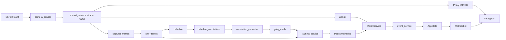

# Guia do código e da arquitetura

Este guia descreve o código presente no workspace em 06/09/2026, incluindo câmera compartilhada, captura com salvamento atômico e correção de caminhos do LabelMe. As propostas de expansão estão identificadas como propostas; não representam funcionalidades prontas.

Para operar a interface, consulte o [manual de uso](MANUAL_DE_USO.md). Para instalar o ambiente, consulte o [manual de reconstrução](MANUAL_RECONSTRUCAO.md). Os resultados de verificações estão no [registro de validação](VALIDACAO_FASE_6.md).

## 1. Visão geral: o que o sistema faz

Há dois fluxos que se encontram nos pesos treinados:

1. **Preparação:** câmera → imagens → anotações LabelMe → rótulos YOLO → dataset dividido → treinamento → arquivo de pesos.
2. **Monitoramento:** câmera → frame → inferência com pesos → detecções → regra de interação → evento → WebSocket → interface.

O navegador não executa YOLO nem acessa diretamente o IP da câmera. Ele conversa com o FastAPI. O LabelMe é um aplicativo desktop iniciado no computador do backend, e não uma página embutida no navegador.



## 2. Onde está cada coisa

Os links abaixo são relativos ao repositório e funcionam também ao navegar pelo GitHub.

| Local | Responsabilidade |
|---|---|
| [main.py](../backend/app/main.py) | Cria FastAPI, registra rotas, serve frontend e resultados; coordena início/encerramento da aplicação |
| [core/config.py](../backend/app/core/config.py) | Define `Settings`, caminhos e parâmetros; cria a instância `settings` |
| [core/state.py](../backend/app/core/state.py) | Guarda eventos, clientes WebSocket e status dos trabalhos em memória |
| [worker.py](../backend/app/worker.py) | Coordena captura compartilhada, inferência e publicação de eventos em thread |
| [routers/eventos.py](../backend/app/routers/eventos.py) | API de eventos, controles de monitoramento e WebSocket |
| [routers/stream.py](../backend/app/routers/stream.py) | Converte frames compartilhados em resposta HTTP MJPEG |
| [routers/dataset.py](../backend/app/routers/dataset.py) | Lista/entrega imagens, inicia captura e abre LabelMe |
| [routers/treino.py](../backend/app/routers/treino.py) | Recebe opções de treino, inicia thread e lista experimentos |
| [routers/modelos.py](../backend/app/routers/modelos.py) | Descobre pesos base e treinados no disco |
| [services/camera_service.py](../backend/app/services/camera_service.py) | Único leitor de rede usado pelo serviço compartilhado; extrai JPEGs e decodifica com OpenCV |
| [services/shared_camera.py](../backend/app/services/shared_camera.py) | Compartilha último frame, registra consumidores e controla a vida da conexão |
| [services/vision_service.py](../backend/app/services/vision_service.py) | Carrega YOLO e transforma sua saída em um DataFrame |
| [services/event_service.py](../backend/app/services/event_service.py) | Calcula IoU e gera alertas de interação mão/produto |
| [services/annotation_converter.py](../backend/app/services/annotation_converter.py) | Converte JSON LabelMe em TXT YOLO |
| [services/annotation_paths.py](../backend/app/services/annotation_paths.py) | Repara referências de imagem quebradas antes de abrir LabelMe |
| [services/training_service.py](../backend/app/services/training_service.py) | Prepara dataset, escreve YAML e chama treinamento Ultralytics |
| [capturar_frames.py](../backend/app/capturar_frames.py) | Salva frames em intervalos; aceita fonte injetada e também funciona como CLI |
| [cli_monitor.py](../backend/app/cli_monitor.py) | Monitoramento desktop com janela OpenCV, separado do fluxo web |
| [controllers/api_controller.py](../backend/app/controllers/api_controller.py) | Compatibilidade do CLI: imprime eventos; a chamada HTTP está comentada |
| [scripts/experimento_yolo26.py](../scripts/experimento_yolo26.py) | Treino comparativo manual com dataset já preparado; possui `--help` e `--check` |
| [backend/app/tests](../backend/app/tests) | Testes de API, câmera compartilhada, captura, eventos e anotações |

### Frontend

| Arquivo | Papel |
|---|---|
| [index.html](../frontend/index.html) | Estrutura das quatro abas e formulários |
| [css/style.css](../frontend/css/style.css) | Aparência e disposição da interface |
| [js/api.js](../frontend/js/api.js) | Funções `apiGet` e `apiPost`, com tratamento de respostas HTTP |
| [js/tabs.js](../frontend/js/tabs.js) | Alterna classes CSS para exibir a aba selecionada |
| [js/dashboard.js](../frontend/js/dashboard.js) | Eventos iniciais, WebSocket, vídeo e controles de monitoramento |
| [js/dataset.js](../frontend/js/dataset.js) | Captura, LabelMe, consulta de status e montagem da galeria |
| [js/treino.js](../frontend/js/treino.js) | Preenche modelos, envia parâmetros e consulta status de treino |
| [js/experimentos.js](../frontend/js/experimentos.js) | Lista experimentos e mostra gráficos disponíveis |

Os scripts são carregados no final do HTML, depois dos elementos da página, com `api.js` antes dos consumidores. Não há framework nem etapa de compilação. Ocultar uma aba não interrompe seus temporizadores: consultas de status podem continuar sem que a câmera esteja conectada.

### Dados e artefatos

| Pasta | Conteúdo e origem |
|---|---|
| `data/raw_frames/` | Imagens originais; a captura grava aqui |
| `data/labelme_annotations/` | JSONs salvos pelo LabelMe; contêm classes, pontos e referência para a imagem |
| `data/yolo_labels/` | TXT derivados das anotações |
| `data/dataset/` | Imagens/rótulos copiados para `train` e `val`, mais `data.yaml` |
| `data/external_validation/` | Dataset externo opcional, não versionado |
| `models/pretrained/` | Pesos de partida oferecidos no seletor de modelo base |
| `experiments/treinamentos/` | Pesos, métricas e gráficos gerados pelos treinos |

Imagens originais e anotações são entradas do trabalho. TXT e dataset dividido são derivados. Preservar as entradas permite regenerar os derivados; preservar pesos e métricas permite comparar experimentos.

## 3. Inicialização: ordem de execução

Comando a partir da raiz:

```powershell
.\.venv\Scripts\python.exe -m uvicorn main:app --app-dir backend/app --port 8000 --workers 1
```

1. Uvicorn inclui `backend/app` no caminho de imports e importa `main`.
2. Os imports carregam `settings`, `state`, rotas e a instância compartilhada `camera`. Criar essa instância não abre a rede.
3. FastAPI registra rotas de API/WebSocket e depois os arquivos estáticos. A montagem de `/` fica por último para não interceptar a API.
4. O `lifespan` registra o event loop em `state`, permitindo que threads publiquem mensagens WebSocket.
5. Ao abrir `/`, o navegador carrega HTML/CSS/JS, consulta listas/status e abre o WebSocket.
6. A conexão com a câmera só começa quando um consumidor a solicita.
7. Ao encerrar o servidor, o `lifespan` solicita a parada do monitoramento e fecha a câmera.

O código usa imports como `from core.config import settings`, não uma migração completa para `from app.core...`. Por isso, use o comando acima. Evite misturar imports com nomes diferentes para o mesmo módulo: isso pode criar duas instâncias de estado no mesmo processo.

## 4. Monitoramento: do clique ao evento

1. `dashboard.js` solicita `/api/stream` e envia `POST /api/monitoramento/iniciar`. A ordem efetiva das duas requisições pode variar.
2. A rota de monitoramento chama `worker.iniciar()`, que cria `monitor-worker`.
3. O worker constrói `VisionService`: carrega `MODEL_PATH` e executa uma inferência inicial com imagem vazia para absorver o custo de inicialização.
4. O worker registra o consumidor `monitoramento` na câmera compartilhada.
5. `wait_frame(sequence)` aguarda um frame posterior ao último consumido. O worker não depende da velocidade de leitura do navegador.
6. A cada intervalo de processamento, `processar_frame()` executa YOLO e entrega detecções.
7. `gerar_eventos()` procura sobreposição entre mão e produto.
8. O worker acrescenta timestamp UTC e chama `state.adicionar_evento()`.
9. `AppState` guarda o evento e agenda o broadcast no event loop do FastAPI.
10. `dashboard.js` recebe JSON pelo WebSocket e acrescenta uma linha na lista, sem recarregar a página.

### Contratos de dados

Uma detecção é uma linha com `classe`, `confianca`, `x_min`, `y_min`, `x_max`, `y_max`. As coordenadas são em pixels. Sem detecções, o serviço retorna DataFrame vazio; o consumidor precisa tratar esse caso antes de acessar colunas.

Um evento publicado tem, por exemplo:

```json
{"tipo": "interacao_mao", "produto": "cha", "quantidade": 1, "timestamp": "2026-09-06T04:00:00+00:00"}
```

A função `calcular_area_intersecao` retorna **IoU**, isto é, área da interseção dividida pela área da união, apesar do nome sugerir apenas área. O limiar vem de `IOU_THRESHOLD`.

A regra atual gera no máximo um evento por mão em cada frame processado, escolhendo o primeiro produto cuja IoU atinge o limiar. Não há rastreamento temporal, deduplicação, confirmação de retirada nem atualização de estoque. A mesma interação pode gerar alertas em vários frames. Eventos `inserido` e `retirado` podem ser recebidos pela API, mas não são inferidos automaticamente.

## 5. Câmera: concorrência, parada e falhas

`SharedCamera` guarda somente o último frame, uma sequência crescente e o instante de recebimento. Cada consumidor recebe uma cópia independente. Um consumidor lento pula frames; ele não atrasa a leitura nem retira frames dos outros consumidores.

- `acquire(nome)` registra um consumidor e inicia o leitor se necessário; retorna um token.
- `release(token)` libera esse consumidor e fecha o leitor quando não resta nenhum.
- `wait_frame(...)` espera por uma imagem nova e rejeita imagens com mais de três segundos.
- `frames(...)` envolve aquisição/liberação em um gerador usado pela captura.
- `status()` informa estado, consumidores, erro e idade do último frame.

O proxy registra um consumidor `mjpeg` por conexão HTTP. No `finally`, inclusive em desconexão, libera o token. O worker faz o mesmo com `monitoramento`. A captura fecha seu gerador ao terminar, inclusive quando atinge o limite de imagens.

Ao pressionar Parar, o navegador cancela o vídeo e solicita a parada da inferência. O leitor fecha quando o último consumidor sai; outra aba com vídeo ou captura em andamento pode mantê-lo ativo. A espera por frame é cancelável; a leitura de rede tem timeout de três segundos. Parar não é garantia de interrupção instantânea de uma inferência já em execução.

O leitor de rede usa timeout, reconexão com espera cancelável e resposta HTTP fechada em saída/falha. Extrai JPEGs pelos marcadores de início/fim, aceita vários JPEGs por bloco e limita o buffer a 4 MiB. O proxy recodifica cada frame em JPEG para a resposta `multipart/x-mixed-replace`; atualmente essa codificação se repete por cliente.

**Restrição de execução:** a instância compartilhada pertence ao processo. Dois processos Uvicorn, um CLI ou outro programa acessando diretamente a câmera não compartilham essa instância. Use um worker e não execute os CLIs de câmera simultaneamente ao backend.

## 6. Dataset: captura, anotação e galeria

1. O formulário envia intervalo e quantidade para `POST /api/dataset/capturar`.
2. A rota cria uma thread; a resposta indica início, não conclusão.
3. `capturar_frames` recebe `camera.frames()` como fonte, dispensando nova conexão com a ESP32-CAM.
4. Cada imagem recebe nome com data, identificador e contador. O JPEG é codificado, gravado em `.part` e publicado com `os.replace` apenas depois de completo.
5. Ao concluir, a thread atualiza total/status. Sem novos frames durante 15 segundos, a fonte gera erro.
6. O JavaScript consulta status a cada quatro segundos e recarrega a galeria quando a captura conclui ou falha.
7. A listagem compara nomes com JSONs em `labelme_annotations`; existência do JSON significa “anotado”, não validação da qualidade da anotação.
8. A galeria usa nomes codificados na URL, versão baseada na modificação do arquivo e botão de nova tentativa em falhas.

O botão LabelMe chama `preparar_anotacoes()` antes de `subprocess.Popen`. JSONs com `imageData` embutido ou referência válida são preservados. Uma referência quebrada é reparada somente se houver uma única imagem de mesmo nome-base. O caminho fica relativo ao JSON, por exemplo `../raw_frames/frame.jpg`. Referências ausentes/ambíguas produzem erro antes de iniciar o aplicativo.

`Popen` retornar um PID comprova criação do processo, não que a janela já terminou de carregar. O backend não controla o ciclo de edição do LabelMe. Depois de salvar anotações, recarregue a página para atualizar seus indicadores.

## 7. Treinamento: das suas imagens aos pesos

1. `treino.js` consulta `GET /api/modelos` e preenche o seletor com arquivos `.pt` de `models/pretrained`.
2. O formulário envia modelo base, épocas, tamanho e fração para `POST /api/treino/start`.
3. A rota verifica existência do modelo solicitado e se sua thread de treino está ativa. Inicia uma thread separada.
4. `rodar_pipeline_treinamento()` decide entre dataset próprio e externo, conforme `USE_EXTERNAL_VALIDATION_DATASET`.
5. Para o próprio, converte JSONs em TXT YOLO e seleciona imagens que possuem TXT correspondente.
6. Embaralha a lista com semente 42 e usa corte de 80% para treino e 20% para validação. A ordem inicial da listagem de arquivos também influencia o resultado.
7. Copia imagens/rótulos e escreve `data.yaml` com caminho absoluto e lista de classes.
8. Escolhe CUDA quando disponível, senão CPU; instancia `YOLO(base_model)` e chama `train()`.
9. A rota registra `concluido` ou `erro`; o frontend consulta esse estado periodicamente.

A conversão usa os dois primeiros pontos da forma para gerar centro, largura e altura normalizados. Use retângulos do LabelMe. Polígonos não são convertidos corretamente em caixas abrangentes pela implementação atual. Classes desconhecidas e formas com menos de dois pontos são ignoradas; dimensões não positivas da imagem geram erro.

### Modelo base não é modelo de monitoramento

| Configuração | Uso |
|---|---|
| `BASE_MODEL` | Ponto de partida padrão do treinamento; o formulário pode escolher outro para a execução |
| `MODEL_PATH` | Pesos carregados pelo `VisionService` no início do monitoramento |
| `TRAINING_PROJECT` e `TRAINING_NAME` | Destino solicitado ao treinamento |
| `CLASSES` | Ordem dos IDs usada na conversão e na interpretação das detecções próprias |

Treinar não altera automaticamente `MODEL_PATH`. Confira o diretório de saída efetivo — o Ultralytics pode criar outro nome quando já existe um experimento — e configure os pesos desejados. Mudanças no `.env` exigem reiniciar o backend; pesos já carregados não são substituídos no worker em execução.

O treinamento web não passa `batch` explicitamente. Os valores 4/2 citados para a GPU de 4 GB pertencem às orientações e ao script de experimentos, não a uma configuração garantida da rota web. Não execute dois treinos simultâneos; a checagem da rota não coordena processos externos e não constitui trava global de GPU.

Outro limite: o pipeline copia arquivos, mas não limpa os derivados anteriores. TXT ou amostras antigas podem permanecer após remover anotações/mudar o conjunto. Uma futura preparação isolada por execução deve resolver isso antes de tratar os splits como reproduzíveis.

## 8. Rotas e quem as utiliza

| Método e caminho | Consumidor / resultado |
|---|---|
| `GET /api/health` | Verifica servidor; não testa câmera ou GPU |
| `GET /api/modelos` | Seletor de treino; retorna `pretreinados` e `treinados` |
| `GET /api/eventos` | Lista os eventos em memória |
| `POST /api/eventos` | Publica evento externo; retorna 201 |
| `WS /ws/eventos` | Entrega novos eventos à interface |
| `POST /api/monitoramento/iniciar` | Inicia worker |
| `POST /api/monitoramento/parar` | Solicita parada do worker |
| `GET /api/monitoramento/status` | Status/erro, câmera e idade do processamento |
| `GET /api/stream` | Vídeo MJPEG; mantém consumidor enquanto conectado |
| `POST /api/dataset/capturar` | Inicia captura em thread |
| `GET /api/dataset/capturar/status` | Estado, erro e total ao concluir |
| `POST /api/dataset/anotar` | Prepara referências e inicia LabelMe desktop |
| `GET /api/dataset/imagens` | Nomes, anotado/pendente e versão |
| `GET /api/dataset/imagens/{nome}` | Arquivo de imagem |
| `POST /api/treino/start` | Inicia treinamento |
| `GET /api/treino/status` | Estado e erro do treino |
| `GET /api/treino/experimentos` | Pastas e presença de resultados/pesos |
| `/static/experiments/...` | Arquivos de experimentos, se a pasta existia na inicialização |
| `/` | Frontend estático |

A documentação interativa gerada pelo FastAPI está em `/docs`. As requisições de status do navegador não abrem o stream da ESP32-CAM.

## 9. Dependências e estado

`settings` depende de `pydantic-settings`, lê `.env` na raiz com prefixo `TCC_` e calcula caminhos a partir de `__file__`. Evite construir caminhos a partir da pasta atual do terminal.

| Dependência | Uso no projeto |
|---|---|
| FastAPI / Uvicorn | Rotas, ciclo de vida e servidor ASGI |
| asyncio / AnyIO | WebSocket, streaming e ponte com trabalho bloqueante |
| threading | Leitura da câmera, monitoramento, captura e treino |
| OpenCV / NumPy | JPEG, frames e janela do CLI |
| Ultralytics / PyTorch | Inferência e treino |
| pandas | Tabela de detecções consumida pelas regras |
| LabelMe / PySide6 | Anotação desktop e GUI |
| pytest / TestClient | Verificações automatizadas |

`AppState` é um objeto global por processo. Guarda até 200 eventos em `deque`, protegida por lock para acesso entre threads. Reiniciar perde o histórico. Não há banco de dados, entrega durável ou confirmação de recebimento pelo navegador. O broadcast percorre os clientes; filas independentes por cliente ainda não existem.

As threads de captura/treino são daemon: não há retomada de trabalho após reinício. O `lifespan` encerra monitoramento/câmera, mas não implementa cancelamento e espera completos para todos os trabalhos. Esses limites precisam ser considerados ao expandir a execução de tarefas.

## 10. Como expandir sem misturar responsabilidades

As mudanças desta seção são **propostas**, não funcionalidades existentes.

| Expansão | Onde implementar | Dependências e validação necessárias |
|---|---|---|
| Adicionar produto/classe | `settings.CLASSES`, anotações, conversão e pesos | Preservar ordem dos IDs, regenerar dataset e treinar pesos compatíveis; testar mapeamento |
| Inferir inserção/retirada | Serviço temporal de eventos, chamado pelo worker | Guardar estado entre frames, tratar oclusão e confirmar transições; testar sequências completas |
| Evitar alertas repetidos | Regra temporal de eventos | Definir janela/identidade do objeto e quando uma interação termina |
| Desenhar caixas no vídeo | Saída da visão e proxy | Associar detecções à sequência correta; desenhar em cópia para não alterar frames da captura |
| Escolher pesos de inferência pela tela | Nova rota, worker e dashboard | Validar arquivo/classes, parar worker e recarregar modelo; não reutilizar implicitamente o seletor de treino |
| Barra de progresso do treino | Callbacks Ultralytics, estado e `treino.js` | Publicar época atual/total e métricas; preservar status de erro |
| Dataset reproduzível | `training_service` | Preparar em diretório por execução, ordenar entradas, registrar split e validar pares imagem/rótulo |
| Histórico persistente | Serviço de repositório de eventos | Salvar antes de publicar, definir IDs, consulta paginada e teste de reinício |
| Célula de carga | Novo serviço de leitura e regra de fusão | Sincronizar timestamps com visão e testar leituras ausentes/atrasadas |
| Várias câmeras | Registro de `SharedCamera` por identificador | Identificar câmera em rotas, eventos, worker e interface; definir limites de processamento |
| Vários processos/servidores | Serviço externo de aquisição e mensageria | Substituir estado global em memória; singleton Python não compartilha dados entre processos |

### Exemplo de desenvolvimento de uma nova funcionalidade

Para adicionar “selecionar modelo para monitoramento”:

1. Defina o contrato da rota: entrada com identificador do modelo e resposta com estado da troca.
2. Use a descoberta de modelos treinados para resolver esse identificador; não aceite um caminho arbitrário sem validação.
3. Implemente a coordenação no worker/serviço: interromper processamento, carregar e validar o novo modelo, publicar sucesso ou erro.
4. Defina o comportamento se a carga falhar: preservar o modelo anterior ou deixar estado de erro explícito.
5. Acrescente seletor e feedback no dashboard.
6. Teste troca com pesos inválidos, classes incompatíveis e monitoramento ativo antes de validar com a câmera.
7. Atualize este guia e o manual de uso com o comportamento final.

A rota traduz HTTP para operações; o serviço executa a regra; o frontend apresenta o resultado. Evite colocar acesso à câmera dentro de uma nova rota: adquira um consumidor do serviço compartilhado e libere-o em `finally`.

## 11. Como investigar problemas e validar mudanças

| Sintoma | Primeiro ponto de investigação |
|---|---|
| API responde, mas não há vídeo | `camera.status()`, consumidores, idade do frame e logs do leitor |
| Vídeo existe, mas não há eventos | Idade do processamento, `MODEL_PATH`, classes previstas e regra de IoU; imagem não garante interação |
| Parar não libera câmera | Lista de consumidores: outra aba/captura; conferir blocos `finally` |
| Imagem quebrada | URL/HTTP da imagem, versão, JPEG decodificável e pasta de saída efetiva |
| LabelMe não mostra janela | Referências `imagePath`, leitura do JSON e possíveis diálogos de erro antes da janela principal |
| Treino não começa | Resposta de `/start`, `/status`, modelo base e pares anotação/imagem |
| Treino concluiu mas detecção não mudou | Caminho de saída real versus `MODEL_PATH` e modelo já carregado |
| CLI imprime “enviado”, mas API não recebe | `requests.post` está comentado em `api_controller.py` |

Execute a suíte na raiz:

```powershell
.\.venv\Scripts\python.exe -m pytest backend/app/tests -v
```

- `test_api.py`: rotas básicas e WebSocket.
- `test_capturar_frames.py`: intervalos, quantidade e gravação com fonte controlada.
- `test_shared_camera.py`: compartilhamento, reconexão, parada, captura, evento simulado e imagens pela API.
- `test_annotation_paths.py`: reparo de referências sem alterar as anotações.
- `test_validacao_final.py`: regras de evento, conversão e acesso aos arquivos da interface/dataset.

Alguns testes usam modelos e imagens presentes no workspace; um clone sem esses artefatos pode falhar mesmo sem regressão de código. Testes simulados não comprovam desempenho na GPU, qualidade do modelo ou interação real. Para mudanças na aquisição, valide também na ESP32-CAM com vídeo e inferência simultâneos. Para treino, execute uma única tarefa real controlada e registre seus parâmetros/resultados.

## 12. Ordem sugerida para ler o código

1. `frontend/index.html` e `main.py`: telas e entradas do sistema.
2. `core/config.py` e `core/state.py`: configuração e dados compartilhados.
3. `routers/eventos.py` e `worker.py`: coordenação do monitoramento.
4. `shared_camera.py` e `camera_service.py`: obtenção e compartilhamento das imagens.
5. `vision_service.py` e `event_service.py`: de pixels a eventos.
6. `routers/dataset.py`, `capturar_frames.py` e `annotation_paths.py`: preparação das entradas.
7. `annotation_converter.py`, `training_service.py` e `routers/treino.py`: preparação e execução do treino.
8. JavaScript de cada aba e testes correspondentes: contratos vistos pelo usuário e comportamento verificado.

Ao alterar um contrato de dados, confira seus dois lados: quem produz e quem consome. Ao acrescentar uma thread ou consumidor da câmera, defina também como termina. Ao gerar um novo artefato, documente onde fica e como ele será usado na etapa seguinte.
