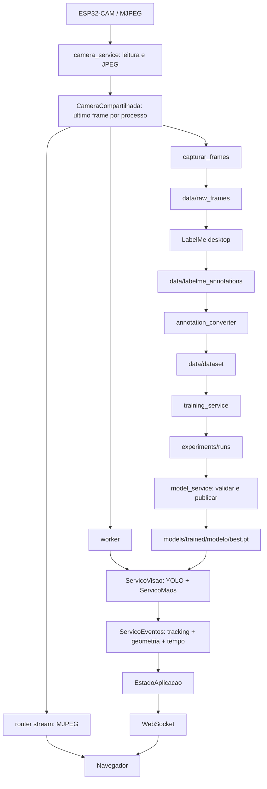
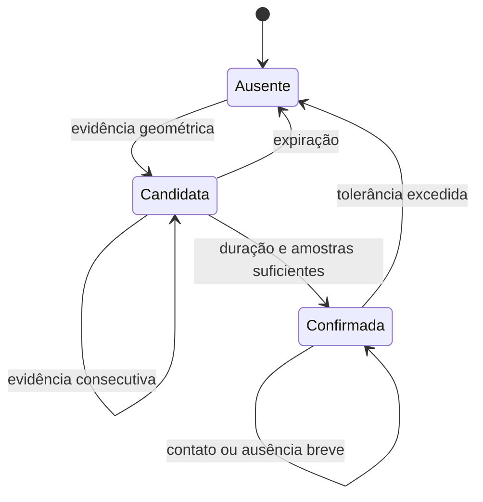

# Manual Técnico

Referência do código atual do **Controle Autônomo de Inventário**, revisada em 13/09/2026. Este documento explica a implementação existente; o [Manual de Uso](MANUAL_DE_USO.md) reúne instalação, interface, comandos e configuração. Caminhos relativos partem da raiz do repositório.

## Sumário

1. [Escopo e arquitetura](#1-escopo-e-arquitetura)
2. [Inicialização e configuração](#2-inicialização-e-configuração)
3. [Câmera, concorrência e captura](#3-câmera-concorrência-e-captura)
4. [Visão, mãos e rastreamento](#4-visão-mãos-e-rastreamento)
5. [Interpretação de interações](#5-interpretação-de-interações)
6. [Worker, CLI e distribuição de eventos](#6-worker-cli-e-distribuição-de-eventos)
7. [Anotações e treinamento](#7-anotações-e-treinamento)
8. [Catálogo e publicação de modelos](#8-catálogo-e-publicação-de-modelos)
9. [API HTTP, WebSocket e arquivos](#9-api-http-websocket-e-arquivos)
10. [Frontend](#10-frontend)
11. [Scripts de experimento e diagnóstico](#11-scripts-de-experimento-e-diagnóstico)
12. [Testes, limites e manutenção](#12-testes-limites-e-manutenção)
13. [Índice de símbolos do código](#13-índice-de-símbolos-do-código)

## 1. Escopo e arquitetura

O sistema recebe vídeo MJPEG da ESP32-CAM, identifica produtos com YOLO, estima pontos da mão com MediaPipe e registra **interações prováveis**. Também captura imagens, abre LabelMe, converte anotações e treina modelos. O nome “inventário” não implica um contador automático de estoque: não existe banco de estoque nem dedução automática de entrada/saída de unidades.

O evento inferido é `interacao_mao`. Sua interpretação pode ser `contato_provavel` ou `manipulacao_provavel`. Eventos `inserido` e `retirado` podem ser enviados manualmente à API, mas não são inferidos pelo detector.

### 1.1 Camadas

| Local | Responsabilidade |
|---|---|
| [backend/app/main.py](../backend/app/main.py) | Aplicação FastAPI, ciclo de vida, registro de rotas e arquivos estáticos |
| [backend/app/core/config.py](../backend/app/core/config.py) | Configuração Pydantic, caminhos e modelo ativo |
| [backend/app/core/state.py](../backend/app/core/state.py) | Eventos, estados de tarefas e clientes WebSocket em memória |
| [backend/app/worker.py](../backend/app/worker.py) | Thread de monitoramento utilizada pela interface |
| `backend/app/services/` | Câmera, visão, tracking, interações, anotações, treinamento e pesos |
| `backend/app/routers/` | Contratos HTTP/WebSocket e início das tarefas |
| [backend/app/controllers/api_controller.py](../backend/app/controllers/api_controller.py) | Saída de eventos da CLI; HTTP atualmente comentado |
| [backend/app/cli_monitor.py](../backend/app/cli_monitor.py) | Monitor visual OpenCV fora do servidor |
| [backend/app/capturar_frames.py](../backend/app/capturar_frames.py) | Captura reutilizável e entrada de linha de comando |
| `frontend/` | HTML/CSS/JavaScript servido pelo FastAPI, sem etapa de build |
| `scripts/` | Setup de mãos, replay, treino e comparativo experimental |
| `backend/app/tests/` | Testes de regras, contratos, concorrência e arquivos |

Os `__init__.py` marcam os pacotes; não executam o monitoramento. Os imports usam `from core...` e `from services...`, pois `backend/app` é a raiz de imports do processo. Não misture esses imports com `backend.app.core...` no mesmo processo: Python pode carregar módulos duplicados e criar estados independentes.

### 1.2 Fluxos


```mermaid
flowchart TD
    ESP[ESP32-CAM / MJPEG] --> READ[camera_service: leitura e JPEG]
    READ --> SHARED[CameraCompartilhada: último frame por processo]
    SHARED --> STREAM[router stream: MJPEG]
    STREAM --> WEB[Navegador]
    SHARED --> WORK[worker]
    WORK --> VIS[ServicoVisao: YOLO + ServicoMaos]
    VIS --> EVENTS[ServicoEventos: tracking + geometria + tempo]
    EVENTS --> STATE[EstadoAplicacao]
    STATE --> WS[WebSocket]
    WS --> WEB
    SHARED --> CAP[capturar_frames]
    CAP --> RAW[data/raw_frames]
    RAW --> LABEL[LabelMe desktop]
    LABEL --> JSON[data/labelme_annotations]
    JSON --> CONV[annotation_converter]
    CONV --> DATA[data/dataset]
    DATA --> TRAIN[training_service]
    TRAIN --> RUN[experiments/runs]
    RUN --> PUB[model_service: validar e publicar]
    PUB --> WEIGHTS[models/trained/modelo/best.pt]
    WEIGHTS --> VIS
```

A CLI abre seu próprio leitor de câmera. A conexão compartilhada do backend é **por processo**; abrir CLI e backend ao mesmo tempo não compartilha o socket.

### 1.3 Dados e persistência

| Caminho | Conteúdo | Escritor principal |
|---|---|---|
| `data/raw_frames/` | JPEGs originais | Captura |
| `data/labelme_annotations/` | JSONs LabelMe | LabelMe; reparador de referências |
| `data/yolo_labels/` | TXT YOLO derivados | Conversor |
| `data/dataset/` | Imagens/rótulos em train e val; YAML | Pipeline de treino |
| `data/external_validation/` | Dataset externo opcional, não versionado | Preparação externa |
| `models/pretrained/` | Pesos genéricos das quatro arquiteturas | Preparação do ambiente |
| `models/trained/<modelo>/best.pt` | Pesos usados na inferência | Importação inicial e publicação após treino |
| `models/trained/origens.json` | Origens e hashes da importação inicial | Migração dos benchmarks |
| `models/hand_landmarker.task` | Modelo MediaPipe | `setup_hands.py` |
| `experiments/runs/` | Novas execuções de treino | Ultralytics |
| `experiments/benchmarks/` | Dados congelados, métricas e pesos comparativos | Benchmark |
| `experiments/diagnosticos/` | Capturas auxiliares de investigação, quando existentes | Diagnóstico manual |

Os eventos e estados de tarefas não são persistidos. `EstadoAplicacao` guarda no máximo 200 eventos no backend; reiniciar o processo limpa essa memória. Os arquivos de modelos, datasets e experimentos permanecem no disco.

## 2. Inicialização e configuração

### 2.1 main.py

`app = FastAPI(lifespan=lifespan)` cria a aplicação. São registrados os routers de dataset, eventos, stream, modelos e treino; o router WebSocket é incluído separadamente.

`lifespan(app)` registra o event loop em `state.registrar_loop()` antes de atender clientes. Ao encerrar, chama `worker.encerrar()` e `camera.fechar()` por `asyncio.to_thread`, depois remove a referência ao loop. Não inicia YOLO nem abre a câmera durante o simples import.

`health()` devolve `{"status":"ok"}`. É uma verificação da API, não um teste da câmera, GPU ou dos pesos.

As montagens estáticas vêm depois das rotas:

- `/static/experiments` → `settings.TRAINING_PROJECT`.
- `/static/benchmarks` → `settings.BENCHMARKS_DIR`.
- `/` → `frontend/`, com `html=True`.

Os diretórios de experimentos usam `check_dir=False`: a aplicação pode ser criada antes de eles existirem; uma requisição a arquivos inexistentes não passa a produzir gráficos automaticamente.

### 2.2 Configuracoes e seleção única

`BASE_DIR` é calculado por `Path(__file__).resolve().parents[3]`, não pelo diretório atual do terminal. `Configuracoes(BaseSettings)` usa `.env` da raiz em UTF-8, prefixo `TCC_` e ignora entradas extras. A prioridade usual aqui é: valor passado ao construtor, variável do ambiente, `.env`, padrão do código.

`settings = Configuracoes()` é instanciado no import. Editar o arquivo ou o `.env` não altera instâncias já carregadas: reinicie o processo.

`MODELOS` contém `yolov8n`, `yolo12n`, `yolo26s` e `yolo26m`. `MODELO_ATIVO` é um `Literal` dessas opções, com padrão atual `yolo12n`. São propriedades calculadas:

| Propriedade/método | Cálculo | Uso |
|---|---|---|
| `Configuracoes.BASE_MODEL` | `PRETRAINED_MODELS_DIR / (MODELO_ATIVO + ".pt")` | Modelo de partida de um treino novo |
| `Configuracoes.MODEL_PATH` | `TRAINED_MODELS_DIR / MODELO_ATIVO / "best.pt"` | Pesos de inferência |
| `Configuracoes.TRAINING_NAME` | `MODELO_ATIVO` | Nome lógico; o treino real acrescenta identificador único |

Essas três propriedades não são campos de configuração independentes. `TCC_BASE_MODEL` e `TCC_MODEL_PATH` antigos não substituem o caminho calculado. Os diretórios continuam configuráveis.

A referência completa de campos, padrões e limites está em [Configurações do Manual de Uso](MANUAL_DE_USO.md#4-configurações). Os limites Pydantic de cada campo não impõem relações entre tempos; por exemplo, não existe um validador que obrigue o tempo de reset a ser maior que o de liberação.

## 3. Câmera, concorrência e captura

### 3.1 camera_service.gerador_de_frames(url_stream, stop_event=None, on_status=None)

Gerador de imagens BGR NumPy. Recebe URL, evento opcional de parada e callback opcional `on_status(status, erro)`.

1. Reporta `conectando` e abre `urllib.request.urlopen(..., timeout=3)`.
2. Lê blocos de 4096 bytes por `read1`.
3. Acumula bytes até localizar início JPEG `FF D8` e fim `FF D9`.
4. Extrai todos os JPEGs completos encontrados no buffer, decodifica com `cv2.imdecode` e produz frames válidos.
5. Preserva fragmentos incompletos para a leitura seguinte. Sem marcador inicial, conserva somente o último byte, para não perder um marcador dividido entre blocos.
6. Rejeita buffer maior que 4 MiB. Stream vazio gera `ConnectionError`.
7. Em falha, fecha a resposta pelo gerenciador de contexto, reporta `reconectando` e espera dois segundos por `stop.wait(2)`, permitindo interrupção.

Não interpreta todos os cabeçalhos multipart: extrai JPEGs pelos marcadores. Reconecta continuamente até a parada, em vez de propagar cada erro de rede ao consumidor.

### 3.2 CameraCompartilhada

[shared_camera.py](../backend/app/services/shared_camera.py) instancia `camera = CameraCompartilhada(settings.ESP32_STREAM_URL)`. Seus recursos são: `RLock` de ciclo de vida, `Condition` para disponibilização de frames, `Event` de parada, mapa de consumidores, thread leitora, último frame, sequência, instante monotônico de recebimento, status e erro.

| Método | Entrada/retorno | Como funciona e efeitos |
|---|---|---|
| `__init__(url, source=gerador_de_frames)` | URL e gerador injetável | Prepara estado e sincronização, sem abrir a rede |
| `start()` | Sem retorno relevante | Não duplica leitor vivo; limpa frame/idade, cria thread daemon `camera-reader` |
| `acquire(name)` | Nome → token opaco | Sob lock de ciclo de vida, inicia leitor e registra consumidor |
| `release(token)` | Token | Remove consumidor; sem consumidores, chama `close()` |
| `_report(status, error=None)` | Callback do leitor | Atualiza estado, invalida frame e acorda consumidores |
| `_run()` | Alvo da thread | Consome a fonte, copia frame, incrementa sequência, atualiza idade e notifica |
| `wait_frame(sequence=0, timeout=0.5)` | Sequência anterior → `(sequência, cópia)` ou `None` | Só entrega frame posterior e com idade de até 3 s; espera na condição |
| `frames(stop_event=None, timeout=15)` | Gerador de frames | Adquire consumidor `captura`, acompanha sequência e lança `TimeoutError` após 15 s sem frame novo; libera token em `finally` |
| `status()` | Dicionário | Retorna status, erro, nomes dos consumidores, idade e total de frames; transforma `recebendo` em `sem_frames` quando idade passa de 3 s |
| `close()` | Sem retorno relevante | Sinaliza parada, notifica esperas, aguarda até 5 s pela thread; se ela não terminar, lança `RuntimeError`; limpa consumidores e reporta `parado` |

O armazenamento de um único frame reduz atraso: consumidor lento perde frames intermediários. Cópias independentes evitam que um consumidor desenhe sobre a imagem usada por outro. Não há fila ilimitada de imagens.

### 3.3 Captura de JPEGs

[capturar_frames.py](../backend/app/capturar_frames.py) é serviço reutilizável e programa executável.

- `deve_capturar(ultimo_salvamento, agora, intervalo)`: compara diferença de tempos com `>= intervalo`.
- `gerar_nome_arquivo(contador)`: gera `frame_YYYYMMDD_HHMMSS_<uuid8>_<contador4>.jpg`. O UUID reduz colisões entre sessões.
- `capturar_frames(pasta_saida=None, intervalo=2.0, max_frames=0, mostrar_janela=True, fonte_frames=None)`: cria pasta, lê fonte injetada ou conexão direta, usa `time.time()` para o intervalo de salvamento, codifica JPEG e grava primeiro em `.jpg.part`. `os.replace` publica o JPEG completo. Incrementa contador e retorna o total salvo. Zero significa ilimitado; captura pode terminar por fonte esgotada, limite, Q ou Ctrl+C.
- O `finally` fecha o gerador, quando suportado, e destrói janelas OpenCV. O arquivo parcial é removido mesmo após falha.
- `main()`: expõe os argumentos da CLI. Limita intervalo mínimo a 0,1 s e quantidade mínima a zero. Essa normalização é da CLI; o modelo HTTP de captura não possui os mesmos limites.

O backend injeta `camera.frames()` e `mostrar_janela=False`. A captura não roda YOLO nem anota imagens.

## 4. Visão, mãos e rastreamento

### 4.1 ServicoVisao

[vision_service.py](../backend/app/services/vision_service.py) une duas inferências sincronizadas.

`__init__(caminho_pesos=None, device=None)`:

1. Resolve pesos explícitos ou `settings.MODEL_PATH`; arquivo ausente lança `FileNotFoundError`.
2. Carrega `YOLO`, lê `model.names` e exige igualdade dos IDs/nomes com `CLASSES` ou `EXTERNAL_CLASSES`, conforme o modo.
3. Registra e imprime nome/caminho. O caminho explícito é usado pelo replay; não altera o modelo ativo global.
4. Faz aquecimento com imagem preta de 480×640.
5. Cria `ServicoMaos` quando habilitado.

`device` explícito é encaminhado à predição. O monitor normal não passa um dispositivo: usa a seleção do Ultralytics. A arquitetura dos pesos é validada na publicação; este construtor verifica arquivo e classes.

`processar_frame(frame, timestamp=None)`:

- Usa o timestamp fornecido ou `time.monotonic()`.
- Executa YOLO no frame BGR, seleciona o primeiro resultado e lê `xyxy`, `cls` e `conf`.
- Descarta IDs fora do conjunto e, com MediaPipe ativo, descarta caixas YOLO da classe `mao`.
- Acrescenta as mãos produzidas por `ServicoMaos` no mesmo frame/timestamp.
- Retorna DataFrame de detecções; grava o timestamp em `df.attrs["timestamp"]`.

Uma linha de produto contém `classe`, `confianca`, `x_min`, `y_min`, `x_max`, `y_max`. Uma linha de mão do MediaPipe também contém `landmarks`, lista de 21 pares `(x,y)` em pixels. O MediaPipe não fornece aqui o mesmo score das caixas YOLO; a coluna `confianca` pode ficar NaN nessa linha. Sem detecções, o DataFrame pode não ter colunas.

A predição não define `conf`, `imgsz` ou IoU de NMS explicitamente. Não confundir o parâmetro de interação `IOU_THRESHOLD` com o limiar de confiança/NMS do YOLO.

`close()` fecha o detector de mãos, se criado.

### 4.2 ServicoMaos

[hand_service.py](../backend/app/services/hand_service.py):

- `HAND_CONNECTIONS`: arestas dos dedos e contorno da palma.
- `__init__()`: exige `HAND_MODEL_PATH`, importa MediaPipe e cria HandLandmarker Tasks em modo `VIDEO`. Número máximo de mãos vem da configuração; detecção, presença e tracking usam 0,5.
- `processar_frame(frame, timestamp)`: transforma segundos em milissegundos e garante timestamp estritamente crescente com `max(anterior+1, atual)`. Converte BGR→RGB, chama `detect_for_video` de modo síncrono, escala x/y normalizados pela largura/altura e calcula a caixa mínima dos 21 pontos.
- `close()`: fecha a instância MediaPipe.

Índices: punho 0; polegar 1–4; indicador 5–8; médio 9–12; anelar 13–16; mínimo 17–20. As pontas são 4, 8, 12, 16 e 20. Esta implementação usa x/y; não usa z nem lateralidade para determinar contato/identidade. O tracking interno do MediaPipe não é o identificador `mao_id` da aplicação.

### 4.3 RastreadorObjetos e geometria básica

[tracking_service.py](../backend/app/services/tracking_service.py):

- `iou(a,b)`: calcula interseção das caixas, áreas não negativas e união. Retorna interseção/união, ou zero para união nula.
- `center(box)`: devolve o ponto médio da caixa.
- `RastreadorObjetos.__init__(ttl=0.6)`: inicia dicionário de tracks e contador de IDs em 1.
- `update(detections,timestamp)`: expira tracks cuja última observação excedeu TTL. Só compara objetos da mesma classe. Para cada par, calcula IoU e distância entre centros dividida pela diagonal da caixa anterior. Aceita candidato com IoU ≥ 0,1 **ou** distância normalizada ≤ 0,5. Ordena por `IoU - distância`, atribui pares de modo guloso e um a um, cria IDs para os restantes e devolve cópias com `track_id`.

O tracker é espacial simples, não ByteTrack, não usa embeddings nem previsão de velocidade. Duas unidades próximas da mesma classe podem trocar IDs. Todos os tipos de objetos compartilham o contador, mas a associação é restrita à classe. Objetos temporariamente perdidos permanecem no dicionário até TTL, porém não são inventados na saída do frame sem detecção.

## 5. Interpretação de interações

[event_service.py](../backend/app/services/event_service.py) recebe detecções, e não imagens. Precisa que YOLO separe corretamente as unidades: uma caixa envolvendo três embalagens continua sendo um único objeto para o tracking.

### 5.1 Funções geométricas

`calcular_area_intersecao` é alias de `iou`, mantido por compatibilidade; retorna uma proporção, não pixels quadrados.

`_segmento_intercepta_caixa(a,b,box,margin)` implementa Liang–Barsky. Representa o segmento por um parâmetro entre 0 e 1 e restringe esse intervalo contra as quatro bordas da caixa expandida. Intervalo vazio significa ausência de interseção. Segmento de comprimento zero permite testar um ponto.

`contact(hand,product,active=False)` retorna `(hit,nodes,method)`:

| Modo | Evidência | Histerese para par confirmado |
|---|---|---|
| Lista/tupla de 21 landmarks | Nó, segmento de HAND_CONNECTIONS ou centro da palma toca a caixa expandida | Margem multiplicada por 1,5 |
| Sem esses landmarks | IoU positiva e ≥ IOU_THRESHOLD | Limiar multiplicado por 0,7 |

A escala da margem é a distância entre pontos 0 e 9, com mínimo de 1 pixel. A margem padrão é 8% dessa escala. Centro da palma é a média de 0, 5, 9, 13 e 17. `nodes` contém apenas os pontos dentro da região: pode ficar vazio quando o contato foi por segmento/centro. `method` vale `landmarks` ou `iou`.

Com MediaPipe ativo, ServicoVisao remove caixas YOLO de mão. Se MediaPipe não encontrar a mão, não há fallback automático para aquela caixa.

`gerar_eventos(df_atual)` é função legada sem memória. Retorna um candidato por produto com pelo menos uma mão em contato, no formato antigo de três campos. Não publica nem confirma temporalmente; worker e CLI usam ServicoEventos.

### 5.2 Movimento conjunto

`_interpretar_movimento(history,hand)` compara centros da primeira e última observações:

1. Menos de três observações → contato provável.
2. Calcula vetores de deslocamento da mão e produto.
3. Ambos precisam atingir o maior valor entre 3 pixels e `INTERACTION_MOTION_MIN_RATIO × diagonal da caixa da mão` (padrão 10%).
4. Exige cosseno entre vetores ≥ 0,8 e razão menor/maior deslocamento ≥ 0,5.
5. Se atender, devolve `manipulacao_provavel`; senão, `contato_provavel`.

É heurística na imagem, não reconhecimento treinado de pegada. Movimento da câmera, caixas instáveis e troca de IDs podem afetar a interpretação. Não determina retirada.

### 5.3 ServicoEventos

`__init__()` chama `reset()`. Este cria RastreadorObjetos com TTL igual a INTERACTION_RELEASE_SECONDS e limpa pares, timestamp anterior, detecções e diagnósticos.

`processar(df_atual,timestamp=None)` devolve somente novos eventos confirmados. O tempo padrão é monotônico; replay fornece tempo do vídeo.

1. Timestamp repetido/regressivo ou salto maior que INTERACTION_RESET_SECONDS reinicia a sessão.
2. Atualiza tracker e remove pares sem contato por mais que INTERACTION_RELEASE_SECONDS.
3. Separa mãos/produtos e percorre todos os pares, identificados por `(mao.track_id,produto.track_id)`.
4. Testa geometria com critério de entrada ou permanência.
5. Inicia duração, amostras, último contato, flag de sequência e histórico para candidatos novos.
6. Antes de confirmar, só acumula tempo se houve evidência na observação anterior e o intervalo não supera INTERACTION_MAX_GAP_SECONDS. Caso contrário, reinicia duração/amostras.
7. Mantém deque de movimento com até 120 observações e janela de até 0,6 s. Falta de sequência ou intervalo excessivo limpa essa janela.
8. Confirma ao alcançar duração mínima (0,3 s) e amostras mínimas (3), emite uma vez e marca o par.
9. Atualiza diagnostics dos pares atualmente em contato. Pares não vistos recebem consecutive=false; os confirmados ficam retidos até expirar a tolerância.
10. Retorna eventos. Lista vazia também pode significar interação já confirmada, e não ausência de contato.

Cada par armazena `last_seen`, `duration`, `samples`, `confirmed`, `consecutive` e `motion`. Não é emitido evento de encerramento. Após expiração, uma aproximação pode gerar nova interação.


```mermaid
stateDiagram-v2
    [*] --> Ausente
    Ausente --> Candidata: evidência geométrica
    Candidata --> Confirmada: duração e amostras suficientes
    Candidata --> Candidata: evidência consecutiva
    Candidata --> Ausente: expiração
    Confirmada --> Confirmada: contato ou ausência breve
    Confirmada --> Ausente: tolerância excedida
```

Uma ausência observada interrompe a acumulação da candidata antes mesmo de expirar o par. Confirmadas toleram ausência breve sem repetir evento. Reset global cria nova sessão de IDs.

### 5.4 Evento e diagnóstico

```json
{
  "tipo": "interacao_mao",
  "produto": "cha",
  "quantidade": 1,
  "mao_id": 1,
  "produto_id": 3,
  "pontos_mao": [8],
  "metodo": "landmarks",
  "interpretacao": "contato_provavel"
}
```

O worker acrescenta timestamp UTC ISO 8601. A interpretação publicada é a do momento da confirmação; alterações posteriores só atualizam diagnóstico. Duas mãos no mesmo produto podem gerar dois eventos, um por par. Quantidade 1 não é contagem de estoque.

`diagnostics` contém mao_id, produto_id, pontos_mao, interpretacao e estado (candidata/confirmada). `detections` contém as detecções atuais com IDs. Não há rota própria que exponha todo o histórico local do ServicoEventos.

### 5.5 Overlay

`desenhar_interacoes(imagem, eventos)`, em [interaction_overlay.py](../backend/app/services/interaction_overlay.py), copia o frame, desenha caixas/IDs e marca produtos confirmados em verde. Desenha conexões, os 21 pontos numerados e linhas de texto com pares/estado/interpretação.

CLI e replay usam o overlay. MJPEG do navegador mostra a câmera sem essas marcas. No baseline do replay, ServicoEventos não é processado; o overlay não mostra as caixas da regra antiga.

## 6. Worker, CLI e distribuição de eventos

### 6.1 Worker

[worker.py](../backend/app/worker.py) mantém _tarefa_monitoramento e _sinal_parada.

| Função | Comportamento |
|---|---|
| `iniciar()` | Retorna false se thread viva; cria evento de parada, define iniciando, limpa idade e inicia daemon monitor-worker |
| `_loop_monitoramento()` | Cria visão/interações, registra modelo/caminho no estado, adquire câmera e processa/publica |
| `parar()` | Se vivo, sinaliza parada e retorna true; não espera encerramento |
| `esta_rodando()` | Consulta existência e estado da thread |
| `encerrar()` | Solicita parada e aguarda até 5 s |

aguardar_frame(sequence) evita reprocessar a mesma sequência. Sem frame, status aguardando_camera; com frame, rodando. A inferência só ocorre após INTERVALO_PROCESSAMENTO desde o início da última. O mínimo de 0,05 s não garante 20 FPS.

O timestamp do DataFrame alimenta ServicoEventos. O evento recebe datetime UTC; state.ultimo_processamento recebe tempo monotônico ao terminar. Falhas de inicialização/processamento definem erro e mensagem. Finalmente, fecha visão e libera token da câmera; a parada normal define parado.

monitor_modelo/monitor_pesos registram a última carga bem-sucedida e não são zerados automaticamente ao parar. Devem ser interpretados junto ao status. A API também informa modelo_configurado.

### 6.2 EstadoAplicacao

[core/state.py](../backend/app/core/state.py):

| Método | O que faz |
|---|---|
| `__init__(max_eventos=200)` | Cria deque limitada, lock, estados de monitor/treino/captura e conjunto de clientes |
| `registrar_loop(loop)` | Guarda loop FastAPI para publicação a partir de threads |
| `adicionar_evento(evento)` | Acrescenta sob lock e agenda _distribuir_evento com run_coroutine_threadsafe quando há loop |
| `listar_eventos()` | Retorna lista sob lock |
| `_distribuir_evento(evento)` | Envia JSON a cópia dos clientes; remove conexões que falharem |

O lock protege o deque. Demais status são atributos simples. Não há persistência, paginação, autenticação, fila durável ou garantia de reenvio.

### 6.3 CLI e controller

`cli_monitor.main()` ajusta imports, cria ServicoVisao/ServicoEventos e abre gerador_de_frames diretamente. Usa a mesma regra temporal e desenha overlay. Frames fora do intervalo são mostrados sem novas marcações. Q encerra; finally fecha fonte, mãos e janelas.

`enviar_eventos(lista_eventos)`, em [api_controller.py](../backend/app/controllers/api_controller.py), ignora lista vazia, acrescenta timestamp local e imprime mensagem. **A publicação HTTP está desativada; o código executa apenas a saída no console.** A mensagem “Evento enviado” não comprova transmissão; a CLI não alimenta API/WebSocket nesse estado.

API_ENDPOINT é o destino previsto, mas não chamado atualmente. O worker não usa esse controller: chama state.adicionar_evento diretamente.

## 7. Anotações e treinamento

### 7.1 Reparação de referências

`preparar_anotacoes(raw_dir,annotation_dir)`, em [annotation_paths.py](../backend/app/services/annotation_paths.py), lê JSONs e preserva os que têm imageData embutido ou imagePath válido. Para os demais:

1. Procura uma única imagem JPG/JPEG/PNG com mesmo nome-base.
2. Ausência/ambiguidade ou falta do campo imagePath gera ValueError.
3. Calcula caminho relativo e substitui somente o valor de imagePath por regex.
4. Prepara todas as alterações antes de começar a escrever.
5. Grava cada JSON por temporário .json.tmp e replace.
6. Retorna total corrigido.

Preserva as anotações e a formatação restante. A validação é prévia, mas as gravações múltiplas não formam transação única: falha posterior de disco pode deixar correção parcial.

### 7.2 Conversão padrão

`converter_arquivo_labelme(caminho_json, pasta_saida, classes=None)`, em [annotation_converter.py](../backend/app/services/annotation_converter.py), exige dimensões positivas, ignora classes desconhecidas e shapes com menos de dois pontos.

**Usa somente os dois primeiros pontos, independentemente do shape_type.** Por isso o fluxo padrão deve usar retângulos; não suporta corretamente polígonos arbitrários como caixas envolventes.

Para imagem W×H:

```text
id = posição da classe em CLASSES
xc = (x1 + x2) / (2W)
yc = (y1 + y2) / (2H)
largura = abs(x2 - x1) / W
altura = abs(y2 - y1) / H
```

Grava id, xc, yc, largura, altura com seis casas decimais em nome_base.txt e retorna o caminho. Não recorta aos limites da imagem nem rejeita explicitamente largura/altura zero.

`converter_labelme_para_yolo(json_dir,output_dir,classes=None)` cria saída, lista JSONs sem recursão, exige pelo menos um e devolve os caminhos convertidos.

### 7.3 training_service

`_resolver_dispositivo()` retorna (0,nome_GPU) se CUDA disponível; caso contrário, ("cpu","CPU").

`rodar_pipeline_treinamento(pasta_fotos=None,pasta_json=None,pasta_yolo=None,pasta_dataset=None,base_model=None,epochs=50,imgsz=640,fraction=1.0)`:

1. Resolve argumentos ou settings; exige base_model igual ao caminho calculado do modelo ativo e arquivo existente.
2. Em modo externo, treina diretamente com EXTERNAL_VALIDATION_DATASET_YAML, sem converter/dividir o dataset próprio.
3. Em modo próprio, exige JSONs, converte e cria images/labels com splits train/val.
4. Lista imagens JPG/JPEG/PNG com TXT correspondente e exige pares.
5. Usa random.Random(42) local, embaralha e divide em int(total×0.8).
6. Copia pares e grava data.yaml com caminho absoluto, splits e nomes.
7. Chama _treinar_dataset e retorna seu resultado.

A lista inicial usa os.listdir sem ordenação; a semente não garante a mesma divisão se a ordem de entrada mudar. O pipeline não limpa splits antigos, não detecta duplicatas e não separa por sessão. Arquivos residuais podem persistir; datasets minúsculos podem gerar split vazio.

`_treinar_dataset(dados, base_model, epochs, imgsz, fraction)` captura MODELO_ATIVO, escolhe dispositivo, cria YOLO e chama train com parâmetros recebidos, TRAINING_PROJECT e nome <modelo>_<uuid12>. Obtém model.trainer.save_dir real, publica weights/best.pt e retorna:

```json
{"modelo":"yolo12n","experimento":".../experiments/runs/yolo12n_<id>","pesos":".../models/trained/yolo12n/best.pt"}
```

Exceções chegam ao chamador. A rota de treino registra status/erro, mas não expõe todo esse retorno final.

### 7.4 Execução pela API

`routers.treino._executar(base_model_path,epochs,imgsz,fraction)` define rodando, chama pipeline e registra concluido ou erro.

`iniciar_treino(entrada)` rejeita thread de treino viva com 409. Campo legado base_model só pode estar vazio ou corresponder ao nome/caminho ativo. Inicia thread daemon e retorna imediatamente.

Não há cancelamento HTTP nem progresso por época. A proteção é local ao processo e não coordena scripts, outro servidor ou outra CLI; não existe trava global de GPU.

## 8. Catálogo e publicação de modelos

[model_service.py](../backend/app/services/model_service.py):

| Função | Contrato |
|---|---|
| `caminhos_modelo(nome=None)` | Usa nome explícito/ativo, valida contra MODELOS e retorna Path genérico e treinado |
| `validar_pesos(caminho, nome, classes_esperadas=None)` | Exige arquivo, carrega YOLO, valida IDs/nomes exatos e origem em ckpt.train_args.model; devolve modelo |
| `publicar_pesos(origem, nome)` | Valida, cria temporário junto ao destino, copia, compara SHA-256, substitui best.pt e limpa temporário; retorna caminho |
| `listar_catalogo()` | Lista quatro opções com nome, base_model, model_path, disponivel e em_uso |

Classes esperadas são as do modo próprio/externo, salvo argumento explícito. A arquitetura é conferida pelo stem do caminho de origem nos metadados, normalizando barras; não por inspeção estrutural completa das camadas.

disponivel só verifica existência dos dois arquivos. em_uso indica configuração selecionada, não prova que worker está carregado. Status do monitoramento fornece essa distinção.

Publicação ocorre depois que train retorna com sucesso. Validação/cópia com falha mantém pesos anteriores. Substituição atômica não modifica objeto YOLO já em memória; afeta a próxima carga.

Os pesos iniciais vêm de comparativo_20260907_50ep_corrigido. origens.json registra essa importação, não cada treino futuro. Os benchmarks originais foram preservados; o conteúdo antigo de experiments/treinamentos foi removido.

## 9. API HTTP, WebSocket e arquivos

Base local padrão: http://localhost:8000. `/docs` fornece Swagger UI, `/redoc` a referência alternativa e `/openapi.json` o esquema gerado do HTTP. WebSocket não é descrito integralmente no OpenAPI.

### 9.1 Inventário de rotas

| Método | Rota | Handler | Retorno/efeito principal |
|---|---|---|---|
| GET | /api/health | main.health | status ok |
| GET | /api/eventos | eventos.listar_eventos | Lista dos eventos retidos |
| POST | /api/eventos | eventos.criar_evento | Valida corpo, acrescenta UTC, guarda e transmite; 201 |
| GET | /api/monitoramento/status | eventos.status_monitoramento | Estado do worker, câmera e modelo |
| POST | /api/monitoramento/iniciar | eventos.iniciar_monitoramento | Solicita iniciar worker; iniciado e status |
| POST | /api/monitoramento/parar | eventos.parar_monitoramento | Solicita parar; parado e status |
| GET | /api/stream | stream.stream_camera | StreamingResponse multipart MJPEG |
| GET | /api/modelos | modelos.listar_modelos | Seleção ativa e catálogo de quatro modelos |
| POST | /api/treino/start | treino.iniciar_treino | Inicia thread de treino; iniciado e base_model |
| GET | /api/treino/status | treino.status_treino | status, erro, modelo_ativo |
| GET | /api/treino/experimentos | treino.listar_experimentos | Resultados de runs e benchmarks |
| GET | /api/dataset/imagens | dataset.listar_imagens | Lista nome, anotado e versao |
| GET | /api/dataset/imagens/{nome} | dataset.obter_imagem | FileResponse da imagem |
| POST | /api/dataset/capturar | dataset.iniciar_captura | Inicia thread; iniciado |
| GET | /api/dataset/capturar/status | dataset.status_captura | status, erro, total |
| POST | /api/dataset/anotar | dataset.abrir_labelme | Abre processo desktop; iniciado, pid e referencias_corrigidas |
| WebSocket | /ws/eventos | eventos.ws_eventos | Envia eventos JSON em tempo real |

As rotas POST sem corpo indicado dispensam JSON. Sucesso normalmente é 200, exceto criação de evento (201). Valores inválidos dos modelos Pydantic produzem 422. Repetir iniciar/parar monitor não necessariamente produz erro: os booleanos indicam se houve ação.

### 9.2 Modelos de entrada

**EventoEntrada**

| Campo | Tipo | Obrigatório/padrão |
|---|---|---|
| tipo | string | Obrigatório; sem enum de tipos |
| produto | string | Obrigatório; sem validação contra CLASSES |
| quantidade | int | 1; sem limite positivo declarado |
| mao_id, produto_id | int ou null | null |
| pontos_mao | lista de int ou null | null |
| metodo, interpretacao | string ou null | null |

criar_evento usa model_dump(exclude_none=True), substitui/acrescenta timestamp UTC e chama state.adicionar_evento. O corpo de entrada não tem campo timestamp; não controla a data persistida. Os campos opcionais ausentes não aparecem no payload. GET /api/eventos retorna `{"eventos":[...]}`.

**TreinoEntrada**

| Campo | Tipo/padrão | Validação |
|---|---|---|
| base_model | string/null; null | Se informado, deve coincidir com modelo ativo |
| epochs | int; 50 | ≥ 1 |
| imgsz | int; 640 | ≥ 32; API não exige múltiplo de 32 |
| fraction | float; 1.0 | > 0 e ≤ 1 |

Thread viva → 409; modelo divergente/arquivo base ausente → 400. Retorno de start não significa que o treino concluiu. Falhas posteriores ficam em GET /api/treino/status.

**CapturaEntrada**

intervalo: float = 2.0; max_frames: int = 20. Não há Field com limites neste modelo. A UI restringe intervalo ≥ 0,1 e quantidade ≥ 1; chamadas diretas podem passar outros valores. Quantidade zero significa ilimitada no serviço. Thread viva → 409. A API não tem rota de cancelar captura.

### 9.3 Monitoramento e MJPEG

status_monitoramento calcula idade desde state.ultimo_processamento. Campos:

```json
{
  "status": "parado",
  "erro": null,
  "camera": {
    "status": "parado",
    "erro": null,
    "consumidores": [],
    "idade_frame_segundos": null,
    "frames_recebidos": 0
  },
  "idade_processamento_segundos": null,
  "modelo_configurado": "yolo12n",
  "modelo_carregado": null,
  "pesos_carregados": null
}
```

Valores são ilustrativos: modelo_carregado/pesos_carregados podem conservar a última carga após parada.

`_frames_mjpeg(request)` adquire token mjpeg em thread auxiliar, aguarda frames por sequência com asyncio.to_thread e recodifica cada imagem para JPEG. Produz boundary `--frame` e cabeçalho Content-Type: image/jpeg. No finally, libera token em CancelScope shield para que cancelamento do cliente não abandone o consumidor.

`stream_camera(request)` devolve StreamingResponse com media_type `multipart/x-mixed-replace; boundary=frame`. Abrir stream pode ativar câmera sem iniciar inferência. Fecha o leitor apenas quando não restam consumidores.

### 9.4 WebSocket

`ws_eventos(websocket)` aceita conexão, inclui cliente em state.ws_clients e aguarda mensagens para manter a sessão. O conteúdo recebido é ignorado. Em WebSocketDisconnect/finally remove o cliente. A aplicação envia eventos por EstadoAplicacao._distribuir_evento; não há mensagens periódicas próprias de heartbeat, confirmação de entrega ou replay automático no socket.

O frontend consulta o histórico por HTTP e abre WebSocket para eventos futuros. Há uma janela entre essas duas ações; o protocolo não oferece cursor para reconciliar eventos perdidos/duplicados.

### 9.5 Catálogo e experimentos

listar_modelos retorna:

- modelo_ativo: nome selecionado.
- modelos: quatro entradas de listar_catalogo().
- pretreinados: nome de arquivo, caminho, tamanho_mb e em_uso.
- treinados: experimento (nome da arquitetura), caminho, tamanho_mb, em_uso e disponivel.

Arquivo ausente tem tamanho informado como zero. A interface usa modelos/modelo_ativo; os demais arrays mantêm compatibilidade.

listar_experimentos percorre recursivamente results.csv de TRAINING_PROJECT e BENCHMARKS_DIR. Para cada diretório retorna nome relativo, tem_resultados=true, tem_pesos e grafico_url (null se results.png ausente). Pastas sem CSV não aparecem. URLs são codificadas e usam a montagem estática correspondente.

### 9.6 Dataset e LabelMe

- `_extensao_valida(nome)`: aceita JPG/JPEG/PNG sem distinguir maiúsculas.
- `listar_imagens()`: lista arquivos válidos; anotado significa somente que existe JSON de mesmo nome-base. versao é st_mtime_ns como string, para invalidar cache.
- `obter_imagem(nome)`: usa basename para limitar ao nome do arquivo; exige existência, retorna 404 senão. FileResponse inclui Cache-Control: no-cache.
- `_executar_captura(intervalo,max_frames)`: zera total, usa fonte compartilhada, sem janela, e registra concluido/erro. Total é atualizado ao finalizar com sucesso, não a cada frame.
- `iniciar_captura(entrada)`: inicia daemon captura-worker; não aguarda salvar as imagens.
- `status_captura()`: responde os três campos de estado.
- `abrir_labelme()`: cria pasta de JSON, repara referências e chama subprocess.Popen com o mesmo Python do backend, -m labelme, pasta de imagens e --output. Falha ao iniciar/reparar retorna 500. Sucesso indica processo iniciado, não que o usuário anotou/salvou.

LabelMe aparece no computador do backend, não na máquina de um navegador remoto.

## 10. Frontend

### 10.1 index.html e style.css

[index.html](../frontend/index.html) contém quatro seções: Monitoramento, Treino, Dataset e Experimentos. Carrega CSS e depois api.js, tabs.js, dashboard.js, treino.js, dataset.js e experimentos.js nessa ordem. Não usa framework, bundler ou npm para operar.

[style.css](../frontend/css/style.css) define layout, cartões, grids, abas, botões, galeria, marcadores de anotação e adaptação visual. Não contém lógica de detecção.

### 10.2 JavaScript por arquivo

| Arquivo/símbolo | Comportamento |
|---|---|
| api.js / `obterJson(caminho)` | fetch GET; lança erro se status não-ok; devolve JSON |
| api.js / `enviarJson(caminho, corpo)` | Serializa corpo se informado, POST JSON; usa detail da resposta no erro quando disponível |
| tabs.js / handlers de clique | Remove active de botões/seções e ativa a seção indicada pelo data-tab; não controla tarefas backend |
| dashboard.js / `adicionarEventoNaLista(evento)` | Cria li com horário local, tipo, produto e quantidade; não mostra todos os metadados |
| dashboard.js / `carregarEventosIniciais()` | GET eventos e adiciona ao DOM |
| dashboard.js / `conectarWebSocket()` | Escolhe ws/wss pelo protocolo da página; exibe JSON recebido; reconecta 3 s após fechar |
| dashboard.js / `atualizarStatusMonitor()` | Consulta status a cada 5 s, mostra câmera/modelo e esconde imagem se câmera não estiver recebendo |
| dashboard.js / iniciar | Define src do stream com timestamp para cache, chama POST iniciar e atualiza estado |
| dashboard.js / parar | Remove src, chama POST parar e atualiza estado |
| treino.js / `carregarModelos()` | Consulta catálogo, exibe somente ativo; select fica desabilitado e explica alteração via config |
| treino.js / `atualizarStatusTreino()` | Consulta a cada 4 s; mostra modelo, estado e erro |
| treino.js / submit | Envia epochs/imgsz/fraction; não escolhe base_model independente |
| dataset.js / `atualizarStatusCaptura()` | Consulta a cada 4 s; ao concluir/errar recarrega galeria conforme flags capturaAnterior/recarregarAposCaptura |
| dataset.js / `carregarGaleria()` | Cria DOM com imagens lazy, legenda, status e retry; usa encodeURIComponent e versao no URL |
| dataset.js / submit e anotar | Inicia captura com valores do formulário; abre LabelMe pela API e mostra alerta |
| experimentos.js / `carregarExperimentos()` | Busca lista uma vez, cria cartões e usa grafico_url retornada pelo backend |

Trocar de aba não interrompe câmera, treino ou captura. A lista de experimentos não é atualizada periodicamente. A galeria atualiza após captura, mas não recebe notificação do salvamento no LabelMe. Recarregar a página resolve esses dois casos.

O backend limita eventos a 200, mas a lista DOM vai crescendo durante a sessão. O dashboard não desenha detecções sobre o stream.

## 11. Scripts de experimento e diagnóstico

### 11.1 setup_hands.py

`main()` monta destino models/hand_landmarker.task a partir da raiz do script, baixa URL oficial fixa do modelo float16 versão 1 em arquivo .task.part e renomeia. Se o destino existir, apenas informa; não verifica hash nem substitui. Limpa parcial em finally.

O script usa o destino padrão; se HAND_MODEL_PATH for personalizado, o operador deve disponibilizar o arquivo nesse caminho. A instalação do pacote MediaPipe é separada.

### 11.2 experimento_yolo26.py

Apesar do nome histórico, `main()` serve às quatro arquiteturas via MODELO_ATIVO. Aceita --epochs, --imgsz e --check. --check confere existência do peso base e imprime caminhos; não valida todos os pares de anotação, não carrega pesos treinados e não inicia treino. Sem --check chama rodar_pipeline_treinamento.

Não aceita mais os antigos argumentos posicionais para arquitetura, nome, batch ou workers.

### 11.3 replay_interactions.py

`main()` recebe vídeo e --output obrigatório. Recusa JSON/vídeo de saída existentes; abre VideoCapture e exige FPS positivo. Cria ServicoVisao com --weights/--device opcionais.

Tempo por frame é índice/FPS. Os modos são:

- padrão: MediaPipe + ServicoEventos;
- --iou-only: mãos YOLO + ServicoEventos;
- --baseline: mãos YOLO e regra original, primeiro produto que atingir IoU por mão/frame, sem memória.

Se baseline e iou-only forem passados juntos, baseline prevalece. O script define HAND_LANDMARKS_ENABLED conforme o modo, mesmo que settings tenha outro valor.

Exporta eventos com campo segundo. Opcional --annotated-video usa mp4v; não cria pastas-pai de saída. Ao terminar grava frames, fps_video, fps_processamento, modo, parâmetros de interação e eventos. A medição começa depois de carregar/aquecer ServicoVisao; inclui loop de processamento e desenho/escrita do vídeo quando solicitado. Não é FPS de câmera ao vivo.

`avaliar_eventos(eventos, esperados)` associa cada evento uma vez à primeira anotação ainda não usada com mesma classe e tempo entre inicio e fim+tempo_de_confirmacao. Retorna corretos, falsos_ou_duplicados e perdidos. Não valida identidade de instância/mão, não calcula acurácia de tracking nem implementa matching ótimo. Anotações são JSON com produto/inicio/fim; não há schema Pydantic para esse arquivo.

Finalmente libera captura, VideoWriter e visão. O replay não publica na API.

### 11.4 benchmark_tcc.py

`calcular_hash(path)` calcula SHA-256 dos bytes.

`main()` recebe --out obrigatório e --model opcional. Sem --model, exige CUDA e pasta de saída inédita. Congela imagens e rótulos do data/dataset atual, preserva JSONs de origem e regenera caixas de cada anotação usando **todos os pontos**, extremos mínimos/máximos e recorte à imagem. Aceita polygon/rectangle/mask, rejeita classes desconhecidas e caixas degeneradas.

Verifica imagens binariamente idênticas entre train/val por hash. Isso não detecta frames apenas parecidos. Mantém o split existente; não faz nova divisão por sessão. Grava YAML com caminho da cópia e protocol.json com ambiente, hashes e parâmetros. Inicia um subprocesso por modelo, sequencialmente, com logs separados. Ao final reúne summary.json e comparativo.csv.

`treinar_modelo(out,name)` treina a arquitetura solicitada por 50 épocas: patience=0, imgsz=640, batch=2, workers=2, device=0, seed=0, deterministic=true, fraction=1, AdamW, lr0=0.00125, momentum=0.9, weight_decay=0.0005, nbs=64, amp=false, cache=false e close_mosaic=10. Lê o best.pt e reavalia com batch=1, FP32, rect=false, conf=0.001, iou=0.7, max_det=300 e sem augment. Registra métricas globais, por classe, tempo, melhor época no CSV e hash.

Com --model, chama apenas treinar_modelo sobre uma cópia já preparada. A opção é usada pelos subprocessos; não é retomada automática de checkpoint. Reusar diretório com execução existente pode gerar conflitos/nomes incrementados: prefira saída nova para o protocolo completo.

Esse script compara quatro modelos deliberadamente, independentemente de MODELO_ATIVO. Não publica pesos automaticamente.

### 11.5 relatorio_benchmark_tcc.py

- `formatar_numero(value,digits=2)`: formata decimal com vírgula.
- `montar_tabela(headers,rows)`: monta tabela Markdown.
- `main()`: exige resumos e CSVs dos quatro modelos, cada CSV com exatamente 50 linhas de épocas. Produz tabela global, por classe, melhor métrica até época 20/50, comparativo_por_classe.csv, RELATORIO_TCC.md e curvas_map.png com Matplotlib Agg.

O texto de protocolo do relatório contém informações fixas da execução original (GPU, versões, contagens e histórico da conversão). Ao aplicar o script a outro conjunto/ambiente, esse texto precisa ser revisado; não é inteiramente calculado a partir dos arquivos.

Relatórios experimentais permanecem junto ao benchmark, como artefatos de resultado. Os dois documentos de referência do sistema são apenas estes manuais em docs.

## 12. Testes, limites e manutenção

### 12.1 Cobertura existente

| Arquivo de teste | Responsabilidade |
|---|---|
| test_api.py | Saúde, eventos HTTP/WS, modelos, status, lista de experimentos e dataset |
| test_capturar_frames.py | Intervalos, nomes, limite, pasta de saída e fonte finita |
| test_shared_camera.py | Consumidores simultâneos, cópias, reconexão, fechamento, stream/worker/captura juntos, imagens Unicode |
| test_annotation_paths.py | Corrigir referência sem alterar anotação; imagem ausente não altera JSON |
| test_validacao_final.py | Candidatos legados, IoU nula, conversão e arquivos da interface |
| test_interactions.py | Vários produtos/mãos, passagem, deduplicação, lacunas, geometria dos dedos, movimento e sincronização visão/mãos |
| test_model_selection.py | Quatro caminhos, rejeição de modelo, env legado, gráficos, publicação válida/falha e resultado do treino |

Os 59 testes passaram na migração de modelos anterior a esta consolidação. Houve também inferência CPU dos quatro pesos no mesmo frame e teste de YOLO+MediaPipe em vídeo sintético. Esses resultados não medem precisão em todas as cenas reais. Uma edição de documentação não equivale a nova validação de desempenho.

Execute a suíte conforme o Manual de Uso. Testes usam fontes falsas/mocks para não depender da câmera nem iniciar treinos longos. Arquivos temporários são criados pelos testes.

### 12.2 Limites que afetam o uso

| Limite atual | Consequência |
|---|---|
| Detecção agrupa embalagens | Tracking não consegue contar/separar unidades que não recebeu |
| Oclusão e 2D | Pontos próximos na imagem não provam contato físico |
| Tracking espacial simples | IDs podem trocar/perder estabilidade em cruzamentos |
| Camera/CLI em processos distintos | Compartilhamento não se estende entre eles |
| Dados semelhantes entre splits | Métricas de validação podem não representar novas disposições |
| Conversor padrão usa dois pontos | Polígonos exigem correção/conversão adequada antes do treino normal |
| Pasta de dataset reaproveitada | Arquivos antigos podem permanecer nos splits |
| Eventos somente em memória | Reinício perde histórico |
| POST da CLI comentado | Terminal não implica publicação na API |
| Sem cancelamento de treino/captura HTTP | Planejar execuções finitas; interrupção pelo processo pode ser necessária |
| Sem autenticação/coordenação global | Operação prevista para ambiente local e um processo servidor |

### 12.3 Onde alterar uma funcionalidade

| Mudança | Arquivos envolvidos |
|---|---|
| Escolher arquitetura | config.py / MODELO_ATIVO; reinício |
| Novas classes | CLASSES, anotações, pesos treinados e validação de names |
| Geometria/tempo de interação | event_service.py, config.py, test_interactions.py |
| Tracking | tracking_service.py e testes de identidade |
| Novo metadado no evento | ServicoEventos, EventoEntrada, frontend se precisar exibir |
| Overlay no navegador | Exige alteração explícita do fluxo do stream; overlay atual é local |
| Envio HTTP da CLI | api_controller.py; publicação HTTP desativada |
| Converter polígonos no treino normal | annotation_converter.py, testes e comparação de rótulos |
| Nova arquitetura no catálogo | MODELOS, Literal de MODELO_ATIVO, pesos base/treinados, benchmark se aplicável |
| Novo botão/rota | router, schema de entrada, frontend e teste de contrato |

Mantenha as camadas separadas. Não incorpore hardware/treino real em testes de regra. Para mudanças na interpretação, compare vídeos reservados de cenas reais; não ajuste e avalie apenas nos mesmos frames.

## 13. Índice de símbolos do código

Atualizado a partir das assinaturas Python em 13/09/2026. As classes e funções
anteriores continuam disponíveis pelos adaptadores documentados em
[Refatoração](REFATORACAO.md). Os links apontam para a definição atual.

### backend/app/capturar_frames.py

| Símbolo / assinatura | Código |
|---|---|
| `deve_capturar(ultimo_salvamento, agora, intervalo)` | [linha 14](../backend/app/capturar_frames.py#L14) |
| `gerar_nome_arquivo(contador)` | [linha 19](../backend/app/capturar_frames.py#L19) |
| `_salvar_jpeg(imagem, caminho)` | [linha 23](../backend/app/capturar_frames.py#L23) |
| `capturar_frames(pasta_saida=None, intervalo=2.0, max_frames=0, mostrar_janela=True, fonte_frames=None)` | [linha 36](../backend/app/capturar_frames.py#L36) |
| `main()` | [linha 87](../backend/app/capturar_frames.py#L87) |

### backend/app/cli_monitor.py

| Símbolo / assinatura | Código |
|---|---|
| `main()` | [linha 20](../backend/app/cli_monitor.py#L20) |

### backend/app/controllers/api_controller.py

| Símbolo / assinatura | Código |
|---|---|
| `enviar_eventos(lista_eventos)` | [linha 5](../backend/app/controllers/api_controller.py#L5) |

### backend/app/core/config.py

| Símbolo / assinatura | Código |
|---|---|
| `class Configuracoes` | [linha 15](../backend/app/core/config.py#L15) |
| `Configuracoes.BASE_MODEL(self)` | [linha 66](../backend/app/core/config.py#L66) |
| `Configuracoes.MODEL_PATH(self)` | [linha 70](../backend/app/core/config.py#L70) |
| `Configuracoes.TRAINING_NAME(self)` | [linha 74](../backend/app/core/config.py#L74) |

### backend/app/core/state.py

| Símbolo / assinatura | Código |
|---|---|
| `class EstadoAplicacao` | [linha 7](../backend/app/core/state.py#L7) |
| `EstadoAplicacao.__init__(self, max_eventos=200)` | [linha 8](../backend/app/core/state.py#L8) |
| `EstadoAplicacao.registrar_loop(self, loop)` | [linha 24](../backend/app/core/state.py#L24) |
| `EstadoAplicacao.adicionar_evento(self, evento)` | [linha 27](../backend/app/core/state.py#L27) |
| `EstadoAplicacao.listar_eventos(self)` | [linha 33](../backend/app/core/state.py#L33) |
| `async EstadoAplicacao._distribuir_evento(self, evento)` | [linha 37](../backend/app/core/state.py#L37) |

### backend/app/main.py

| Símbolo / assinatura | Código |
|---|---|
| `async lifespan(app: FastAPI)` | [linha 20](../backend/app/main.py#L20) |
| `health()` | [linha 41](../backend/app/main.py#L41) |

### backend/app/routers/dataset.py

| Símbolo / assinatura | Código |
|---|---|
| `class CapturaEntrada` | [linha 23](../backend/app/routers/dataset.py#L23) |
| `listar_imagens()` | [linha 29](../backend/app/routers/dataset.py#L29) |
| `obter_imagem(nome: str)` | [linha 34](../backend/app/routers/dataset.py#L34) |
| `_executar_captura(intervalo, max_frames)` | [linha 41](../backend/app/routers/dataset.py#L41) |
| `iniciar_captura(entrada: CapturaEntrada)` | [linha 61](../backend/app/routers/dataset.py#L61) |
| `status_captura()` | [linha 77](../backend/app/routers/dataset.py#L77) |
| `abrir_labelme()` | [linha 82](../backend/app/routers/dataset.py#L82) |

### backend/app/routers/eventos.py

| Símbolo / assinatura | Código |
|---|---|
| `class EventoEntrada` | [linha 17](../backend/app/routers/eventos.py#L17) |
| `listar_eventos()` | [linha 29](../backend/app/routers/eventos.py#L29) |
| `criar_evento(evento: EventoEntrada)` | [linha 34](../backend/app/routers/eventos.py#L34) |
| `status_monitoramento()` | [linha 43](../backend/app/routers/eventos.py#L43) |
| `iniciar_monitoramento()` | [linha 52](../backend/app/routers/eventos.py#L52) |
| `parar_monitoramento()` | [linha 58](../backend/app/routers/eventos.py#L58) |
| `async ws_eventos(websocket: WebSocket)` | [linha 64](../backend/app/routers/eventos.py#L64) |

### backend/app/routers/modelos.py

| Símbolo / assinatura | Código |
|---|---|
| `listar_modelos()` | [linha 13](../backend/app/routers/modelos.py#L13) |
| `_tamanho_megabytes(caminho)` | [linha 28](../backend/app/routers/modelos.py#L28) |

### backend/app/routers/stream.py

| Símbolo / assinatura | Código |
|---|---|
| `async _frames_mjpeg(request)` | [linha 14](../backend/app/routers/stream.py#L14) |
| `stream_camera(request: Request)` | [linha 34](../backend/app/routers/stream.py#L34) |

### backend/app/routers/treino.py

| Símbolo / assinatura | Código |
|---|---|
| `class TreinoEntrada` | [linha 18](../backend/app/routers/treino.py#L18) |
| `_executar(base_model_path, epochs, imgsz, fraction)` | [linha 25](../backend/app/routers/treino.py#L25) |
| `iniciar_treino(entrada: TreinoEntrada)` | [linha 37](../backend/app/routers/treino.py#L37) |
| `status_treino()` | [linha 59](../backend/app/routers/treino.py#L59) |
| `listar_experimentos()` | [linha 64](../backend/app/routers/treino.py#L64) |

### backend/app/services/annotation_converter.py

| Símbolo / assinatura | Código |
|---|---|
| `converter_arquivo_labelme(caminho_json, pasta_saida, classes=None)` | [linha 8](../backend/app/services/annotation_converter.py#L8) |
| `converter_labelme_para_yolo(json_dir, output_dir, classes=None)` | [linha 28](../backend/app/services/annotation_converter.py#L28) |
| `_normalizar_formas(formas, largura_imagem, altura_imagem, classes)` | [linha 41](../backend/app/services/annotation_converter.py#L41) |
| `labelme_json_to_yolo(json_path, output_dir, classes=None)` | [linha 64](../backend/app/services/annotation_converter.py#L64) |

### backend/app/services/annotation_paths.py

| Símbolo / assinatura | Código |
|---|---|
| `preparar_anotacoes(raw_dir, annotation_dir)` | [linha 8](../backend/app/services/annotation_paths.py#L8) |
| `_encontrar_imagem(imagens_originais, caminho)` | [linha 35](../backend/app/services/annotation_paths.py#L35) |

### backend/app/services/camera_service.py

| Símbolo / assinatura | Código |
|---|---|
| `gerador_de_frames(url_stream, stop_event=None, on_status=None)` | [linha 11](../backend/app/services/camera_service.py#L11) |
| `_decodificar_resposta(fluxo, sinal_parada)` | [linha 27](../backend/app/services/camera_service.py#L27) |

### backend/app/services/dataset_service.py

| Símbolo / assinatura | Código |
|---|---|
| `_extensao_valida(nome)` | [linha 5](../backend/app/services/dataset_service.py#L5) |
| `listar_imagens(pasta, pasta_anotacoes)` | [linha 9](../backend/app/services/dataset_service.py#L9) |

### backend/app/services/event_service.py

| Símbolo / assinatura | Código |
|---|---|
| `_segmento_intercepta_caixa(a, b, caixa, margem)` | [linha 16](../backend/app/services/event_service.py#L16) |
| `verificar_contato(mao, produto, confirmado=False)` | [linha 36](../backend/app/services/event_service.py#L36) |
| `gerar_eventos(df_atual)` | [linha 55](../backend/app/services/event_service.py#L55) |
| `_interpretar_movimento(historico, mao)` | [linha 66](../backend/app/services/event_service.py#L66) |
| `class ServicoEventos` | [linha 84](../backend/app/services/event_service.py#L84) |
| `ServicoEventos.__init__(self)` | [linha 85](../backend/app/services/event_service.py#L85) |
| `ServicoEventos.reiniciar(self)` | [linha 88](../backend/app/services/event_service.py#L88) |
| `ServicoEventos._atualizar_contato(self, par, mao, produto, timestamp)` | [linha 95](../backend/app/services/event_service.py#L95) |
| `ServicoEventos._processar_par(self, mao, produto, timestamp, pares_observados, eventos)` | [linha 116](../backend/app/services/event_service.py#L116) |
| `ServicoEventos.processar(self, df_atual, timestamp=None)` | [linha 146](../backend/app/services/event_service.py#L146) |
| `contact(hand, product, active=False)` | [linha 174](../backend/app/services/event_service.py#L174) |

### backend/app/services/experiment_service.py

| Símbolo / assinatura | Código |
|---|---|
| `listar_experimentos()` | [linha 6](../backend/app/services/experiment_service.py#L6) |

### backend/app/services/hand_service.py

| Símbolo / assinatura | Código |
|---|---|
| `class ServicoMaos` | [linha 18](../backend/app/services/hand_service.py#L18) |
| `ServicoMaos.__init__(self)` | [linha 19](../backend/app/services/hand_service.py#L19) |
| `ServicoMaos.processar_frame(self, frame, timestamp)` | [linha 38](../backend/app/services/hand_service.py#L38) |
| `ServicoMaos.fechar(self)` | [linha 51](../backend/app/services/hand_service.py#L51) |
| `_converter_pontos(landmarks, largura, altura)` | [linha 58](../backend/app/services/hand_service.py#L58) |

### backend/app/services/interaction_overlay.py

| Símbolo / assinatura | Código |
|---|---|
| `desenhar_interacoes(imagem, eventos)` | [linha 7](../backend/app/services/interaction_overlay.py#L7) |
| `_desenhar_pontos(saida, item, cor)` | [linha 24](../backend/app/services/interaction_overlay.py#L24) |
| `draw_interactions(frame, events)` | [linha 37](../backend/app/services/interaction_overlay.py#L37) |

### backend/app/services/model_service.py

| Símbolo / assinatura | Código |
|---|---|
| `caminhos_modelo(nome=None)` | [linha 13](../backend/app/services/model_service.py#L13) |
| `validar_pesos(caminho, nome, classes_esperadas=None)` | [linha 21](../backend/app/services/model_service.py#L21) |
| `publicar_pesos(origem, nome)` | [linha 36](../backend/app/services/model_service.py#L36) |
| `listar_catalogo()` | [linha 55](../backend/app/services/model_service.py#L55) |
| `_resumo_arquivo(caminho)` | [linha 65](../backend/app/services/model_service.py#L65) |
| `model_paths(name=None)` | [linha 72](../backend/app/services/model_service.py#L72) |
| `publish_weights(source, name)` | [linha 75](../backend/app/services/model_service.py#L75) |
| `validate_weights(path, name, expected_classes=None)` | [linha 78](../backend/app/services/model_service.py#L78) |

### backend/app/services/shared_camera.py

| Símbolo / assinatura | Código |
|---|---|
| `class CameraCompartilhada` | [linha 12](../backend/app/services/shared_camera.py#L12) |
| `CameraCompartilhada.__init__(self, url, source=gerador_de_frames)` | [linha 13](../backend/app/services/shared_camera.py#L13) |
| `CameraCompartilhada.iniciar(self)` | [linha 27](../backend/app/services/shared_camera.py#L27) |
| `CameraCompartilhada.adquirir(self, name)` | [linha 38](../backend/app/services/shared_camera.py#L38) |
| `CameraCompartilhada.liberar(self, token)` | [linha 46](../backend/app/services/shared_camera.py#L46) |
| `CameraCompartilhada._registrar_status(self, status, error=None)` | [linha 52](../backend/app/services/shared_camera.py#L52) |
| `CameraCompartilhada._ler_imagens(self)` | [linha 58](../backend/app/services/shared_camera.py#L58) |
| `CameraCompartilhada._tem_frame_novo(self, sequencia)` | [linha 75](../backend/app/services/shared_camera.py#L75) |
| `CameraCompartilhada.aguardar_frame(self, sequence=0, timeout=0.5)` | [linha 80](../backend/app/services/shared_camera.py#L80) |
| `CameraCompartilhada.gerar_frames(self, stop_event=None, timeout=15)` | [linha 91](../backend/app/services/shared_camera.py#L91) |
| `CameraCompartilhada.status(self)` | [linha 108](../backend/app/services/shared_camera.py#L108) |
| `CameraCompartilhada.fechar(self)` | [linha 118](../backend/app/services/shared_camera.py#L118) |

### backend/app/services/tracking_service.py

| Símbolo / assinatura | Código |
|---|---|
| `_area_caixa(caixa)` | [linha 5](../backend/app/services/tracking_service.py#L5) |
| `iou(a, b)` | [linha 12](../backend/app/services/tracking_service.py#L12) |
| `center(box)` | [linha 21](../backend/app/services/tracking_service.py#L21) |
| `class RastreadorObjetos` | [linha 25](../backend/app/services/tracking_service.py#L25) |
| `RastreadorObjetos.__init__(self, ttl=0.6)` | [linha 27](../backend/app/services/tracking_service.py#L27) |
| `RastreadorObjetos._listar_candidatos(self, deteccoes)` | [linha 32](../backend/app/services/tracking_service.py#L32) |
| `RastreadorObjetos.atualizar(self, detections, timestamp)` | [linha 46](../backend/app/services/tracking_service.py#L46) |

### backend/app/services/training_service.py

| Símbolo / assinatura | Código |
|---|---|
| `_resolver_dispositivo()` | [linha 16](../backend/app/services/training_service.py#L16) |
| `_treinar_dataset(dados, base_model, epochs, imgsz, fraction)` | [linha 22](../backend/app/services/training_service.py#L22) |
| `rodar_pipeline_treinamento(pasta_fotos=None, pasta_json=None, pasta_yolo=None, pasta_dataset=None, base_model=None, epochs=50, imgsz=640, fraction=1.0)` | [linha 36](../backend/app/services/training_service.py#L36) |
| `_preparar_dataset(pasta_fotos, pasta_json, pasta_yolo, pasta_dataset)` | [linha 63](../backend/app/services/training_service.py#L63) |
| `_copiar_conjuntos(conjuntos, pasta_fotos, pasta_yolo, pasta_dataset)` | [linha 108](../backend/app/services/training_service.py#L108) |
| `_train_dataset(data, base_model, epochs, imgsz, fraction)` | [linha 126](../backend/app/services/training_service.py#L126) |

### backend/app/services/vision_service.py

| Símbolo / assinatura | Código |
|---|---|
| `class ServicoVisao` | [linha 13](../backend/app/services/vision_service.py#L13) |
| `ServicoVisao.__init__(self, caminho_pesos=None, device=None)` | [linha 14](../backend/app/services/vision_service.py#L14) |
| `ServicoVisao.fechar(self)` | [linha 31](../backend/app/services/vision_service.py#L31) |
| `ServicoVisao.processar_frame(self, frame, timestamp=None)` | [linha 35](../backend/app/services/vision_service.py#L35) |

### backend/app/tests/conftest.py

| Símbolo / assinatura | Código |
|---|---|
| `ambiente_temporario(monkeypatch, tmp_path)` | [linha 12](../backend/app/tests/conftest.py#L12) |

### backend/app/tests/test_annotation_paths.py

| Símbolo / assinatura | Código |
|---|---|
| `test_repara_apenas_caminho_e_preserva_anotacoes(tmp_path)` | [linha 7](../backend/app/tests/test_annotation_paths.py#L7) |
| `test_imagem_ausente_nao_altera_json(tmp_path)` | [linha 22](../backend/app/tests/test_annotation_paths.py#L22) |

### backend/app/tests/test_api.py

| Símbolo / assinatura | Código |
|---|---|
| `cliente()` | [linha 10](../backend/app/tests/test_api.py#L10) |
| `test_saude(cliente)` | [linha 17](../backend/app/tests/test_api.py#L17) |
| `test_listar_eventos_vazio_ou_com_itens(cliente)` | [linha 23](../backend/app/tests/test_api.py#L23) |
| `test_criar_evento_aparece_na_listagem(cliente)` | [linha 29](../backend/app/tests/test_api.py#L29) |
| `test_websocket_eventos_recebe_broadcast(cliente)` | [linha 42](../backend/app/tests/test_api.py#L42) |
| `test_listar_modelos_inclui_os_4_pretreinados(cliente)` | [linha 52](../backend/app/tests/test_api.py#L52) |
| `test_status_treino_inicial_ocioso(cliente)` | [linha 59](../backend/app/tests/test_api.py#L59) |
| `test_listar_experimentos_retorna_lista(cliente)` | [linha 65](../backend/app/tests/test_api.py#L65) |
| `test_treino_start_com_modelo_inexistente_retorna_400(cliente)` | [linha 72](../backend/app/tests/test_api.py#L72) |
| `test_listar_imagens_dataset(cliente)` | [linha 77](../backend/app/tests/test_api.py#L77) |
| `test_obter_imagem_inexistente_404(cliente)` | [linha 85](../backend/app/tests/test_api.py#L85) |
| `test_status_monitoramento_inicial(cliente)` | [linha 90](../backend/app/tests/test_api.py#L90) |

### backend/app/tests/test_capturar_frames.py

| Símbolo / assinatura | Código |
|---|---|
| `test_deve_capturar_intervalo_nao_decorrido()` | [linha 10](../backend/app/tests/test_capturar_frames.py#L10) |
| `test_deve_capturar_intervalo_decorrido_exato()` | [linha 14](../backend/app/tests/test_capturar_frames.py#L14) |
| `test_deve_capturar_intervalo_excedido()` | [linha 18](../backend/app/tests/test_capturar_frames.py#L18) |
| `test_gerar_nome_arquivo_eh_unico_por_contador()` | [linha 22](../backend/app/tests/test_capturar_frames.py#L22) |
| `_frame_falso()` | [linha 30](../backend/app/tests/test_capturar_frames.py#L30) |
| `test_capturar_frames_respeita_max_frames_com_fonte_falsa(tmp_path)` | [linha 34](../backend/app/tests/test_capturar_frames.py#L34) |
| `test_capturar_frames_cria_pasta_saida_se_nao_existir(tmp_path)` | [linha 50](../backend/app/tests/test_capturar_frames.py#L50) |
| `test_capturar_frames_sem_max_frames_para_com_fonte_finita(tmp_path)` | [linha 62](../backend/app/tests/test_capturar_frames.py#L62) |

### backend/app/tests/test_interactions.py

| Símbolo / assinatura | Código |
|---|---|
| `caixa_teste(classe, x=0, y=0, tamanho=20, **extra)` | [linha 10](../backend/app/tests/test_interactions.py#L10) |
| `quadro_teste(*produtos, maos=1)` | [linha 14](../backend/app/tests/test_interactions.py#L14) |
| `limiares(monkeypatch)` | [linha 19](../backend/app/tests/test_interactions.py#L19) |
| `confirmar(servico, deteccoes, inicio=0)` | [linha 28](../backend/app/tests/test_interactions.py#L28) |
| `test_tres_produtos_sem_eventos_repetidos()` | [linha 34](../backend/app/tests/test_interactions.py#L34) |
| `test_passagem_por_um_produto_e_contato_com_outro()` | [linha 45](../backend/app/tests/test_interactions.py#L45) |
| `test_liberacao_permite_nova_interacao()` | [linha 54](../backend/app/tests/test_interactions.py#L54) |
| `test_observacoes_ausentes_nao_contam_como_contato()` | [linha 64](../backend/app/tests/test_interactions.py#L64) |
| `test_imagens_lentas_e_lacuna_nao_confirmam()` | [linha 74](../backend/app/tests/test_interactions.py#L74) |
| `test_objetos_reordenados_mantem_ids_distintos()` | [linha 86](../backend/app/tests/test_interactions.py#L86) |
| `test_duas_maos_formam_pares_independentes()` | [linha 94](../backend/app/tests/test_interactions.py#L94) |
| `test_pontos_rejeitam_regiao_vazia_da_caixa_da_mao()` | [linha 102](../backend/app/tests/test_interactions.py#L102) |
| `test_contato_da_ponta_do_dedo_e_segmento()` | [linha 113](../backend/app/tests/test_interactions.py#L113) |
| `test_area_zero_e_ausencia_de_sobreposicao()` | [linha 124](../backend/app/tests/test_interactions.py#L124) |
| `test_relogio_regressivo_inicia_novo_candidato()` | [linha 129](../backend/app/tests/test_interactions.py#L129) |
| `test_api_preserva_metadados_da_mao()` | [linha 136](../backend/app/tests/test_interactions.py#L136) |
| `test_movimento_conjunto_indica_manipulacao_sem_duplicar_evento()` | [linha 147](../backend/app/tests/test_interactions.py#L147) |
| `test_movimento_isolado_da_mao_nao_indica_manipulacao()` | [linha 158](../backend/app/tests/test_interactions.py#L158) |
| `test_visao_usa_mesmo_instante_e_substitui_mao_yolo(monkeypatch)` | [linha 165](../backend/app/tests/test_interactions.py#L165) |

### backend/app/tests/test_model_selection.py

| Símbolo / assinatura | Código |
|---|---|
| `test_selecao_resolve_ambos_os_caminhos(name)` | [linha 14](../backend/app/tests/test_model_selection.py#L14) |
| `test_modelo_desconhecido_rejeitado()` | [linha 21](../backend/app/tests/test_model_selection.py#L21) |
| `test_ambiente_antigo_nao_sobrescreve_caminhos(monkeypatch)` | [linha 26](../backend/app/tests/test_model_selection.py#L26) |
| `test_catalogo_e_graficos_benchmark()` | [linha 34](../backend/app/tests/test_model_selection.py#L34) |
| `test_treino_nao_pode_escolher_outro_modelo()` | [linha 48](../backend/app/tests/test_model_selection.py#L48) |
| `test_pesos_invalidos_preservam_arquivo_ativo(monkeypatch, tmp_path)` | [linha 55](../backend/app/tests/test_model_selection.py#L55) |
| `test_publicacao_e_falha_na_copia(monkeypatch, tmp_path)` | [linha 70](../backend/app/tests/test_model_selection.py#L70) |
| `test_treino_publica_saida_real_apenas_apos_sucesso(monkeypatch, tmp_path)` | [linha 86](../backend/app/tests/test_model_selection.py#L86) |

### backend/app/tests/test_protecao_refatoracao.py

| Símbolo / assinatura | Código |
|---|---|
| `test_json_invalido_nao_cria_rotulo(tmp_path)` | [linha 16](../backend/app/tests/test_protecao_refatoracao.py#L16) |
| `test_poligono_da_aplicacao_preserva_regra_historica(tmp_path)` | [linha 24](../backend/app/tests/test_protecao_refatoracao.py#L24) |
| `test_reparo_valida_todos_os_arquivos_antes_de_gravar(tmp_path)` | [linha 34](../backend/app/tests/test_protecao_refatoracao.py#L34) |
| `test_camera_descarta_imagem_antiga(monkeypatch)` | [linha 47](../backend/app/tests/test_protecao_refatoracao.py#L47) |
| `test_estado_limita_historico_e_remove_cliente_desconectado()` | [linha 57](../backend/app/tests/test_protecao_refatoracao.py#L57) |
| `test_falha_da_visao_libera_consumidor(monkeypatch)` | [linha 76](../backend/app/tests/test_protecao_refatoracao.py#L76) |

### backend/app/tests/test_scripts.py

| Símbolo / assinatura | Código |
|---|---|
| `criar_anotacao(caminho, pontos=None, tipo='polygon', classe='cha')` | [linha 13](../backend/app/tests/test_scripts.py#L13) |
| `test_benchmark_usa_todos_os_pontos_e_recorta_limites(tmp_path)` | [linha 22](../backend/app/tests/test_scripts.py#L22) |
| `test_benchmark_rejeita_anotacao_incompativel(tmp_path, alteracao)` | [linha 31](../backend/app/tests/test_scripts.py#L31) |
| `preparar_origem_benchmark(raiz, duplicar=False)` | [linha 38](../backend/app/tests/test_scripts.py#L38) |
| `test_congelamento_preserva_origem_e_registra_hashes(monkeypatch, tmp_path)` | [linha 51](../backend/app/tests/test_scripts.py#L51) |
| `test_congelamento_rejeita_imagem_repetida(monkeypatch, tmp_path)` | [linha 65](../backend/app/tests/test_scripts.py#L65) |
| `test_avaliacao_replay_conta_duplicatas_e_perdas()` | [linha 74](../backend/app/tests/test_scripts.py#L74) |
| `test_baseline_mantem_primeiro_produto_por_mao()` | [linha 82](../backend/app/tests/test_scripts.py#L82) |
| `preparar_resultados(pasta, epocas=50)` | [linha 92](../backend/app/tests/test_scripts.py#L92) |
| `test_relatorio_gera_markdown_csv_e_figura(monkeypatch, tmp_path)` | [linha 107](../backend/app/tests/test_scripts.py#L107) |
| `test_relatorio_rejeita_treino_incompleto(monkeypatch, tmp_path)` | [linha 118](../backend/app/tests/test_scripts.py#L118) |
| `test_replay_processa_video_e_fecha_recursos(monkeypatch, tmp_path, modo)` | [linha 128](../backend/app/tests/test_scripts.py#L128) |

### backend/app/tests/test_servicos_refatorados.py

| Símbolo / assinatura | Código |
|---|---|
| `test_interfaces_anteriores_aceitam_argumentos_nomeados(tmp_path)` | [linha 14](../backend/app/tests/test_servicos_refatorados.py#L14) |
| `test_pontos_da_mao_convertidos_para_pixels()` | [linha 26](../backend/app/tests/test_servicos_refatorados.py#L26) |
| `test_maos_exigem_instantes_crescentes(monkeypatch)` | [linha 33](../backend/app/tests/test_servicos_refatorados.py#L33) |
| `test_validacao_de_pesos_confere_classes_e_arquitetura(monkeypatch, tmp_path)` | [linha 47](../backend/app/tests/test_servicos_refatorados.py#L47) |
| `test_dataset_separa_pares_sem_alterar_aleatoriedade_global(monkeypatch)` | [linha 63](../backend/app/tests/test_servicos_refatorados.py#L63) |
| `test_falha_codificacao_nao_publica_jpeg(monkeypatch, tmp_path)` | [linha 86](../backend/app/tests/test_servicos_refatorados.py#L86) |
| `test_falha_treino_e_captura_atualiza_estado(monkeypatch)` | [linha 95](../backend/app/tests/test_servicos_refatorados.py#L95) |
| `test_controlador_ignora_ausencia_de_eventos(eventos, capsys)` | [linha 112](../backend/app/tests/test_servicos_refatorados.py#L112) |

### backend/app/tests/test_shared_camera.py

| Símbolo / assinatura | Código |
|---|---|
| `test_broadcast_uma_conexao_copias_e_consumidor_lento()` | [linha 20](../backend/app/tests/test_shared_camera.py#L20) |
| `test_reconecta_fecha_respostas_e_decodifica_varios_jpegs(monkeypatch)` | [linha 44](../backend/app/tests/test_shared_camera.py#L44) |
| `test_stream_worker_captura_e_evento_ws_mesma_fonte(monkeypatch, tmp_path)` | [linha 70](../backend/app/tests/test_shared_camera.py#L70) |
| `test_parar_worker_sem_frames(monkeypatch)` | [linha 112](../backend/app/tests/test_shared_camera.py#L112) |
| `test_ultimo_consumidor_fecha_e_permite_reiniciar()` | [linha 130](../backend/app/tests/test_shared_camera.py#L130) |
| `test_captura_libera_camera_ao_atingir_limite(tmp_path)` | [linha 154](../backend/app/tests/test_shared_camera.py#L154) |
| `test_galeria_unicode_e_jpeg_completo(monkeypatch, tmp_path)` | [linha 166](../backend/app/tests/test_shared_camera.py#L166) |
| `test_stream_desconectado_libera_consumidor(monkeypatch)` | [linha 186](../backend/app/tests/test_shared_camera.py#L186) |

### backend/app/tests/test_validacao_final.py

| Símbolo / assinatura | Código |
|---|---|
| `test_eventos_mao_sobre_produto_e_frame_vazio()` | [linha 16](../backend/app/tests/test_validacao_final.py#L16) |
| `test_iou_area_nula()` | [linha 27](../backend/app/tests/test_validacao_final.py#L27) |
| `test_conversao_retangulo_invertido_e_classe_desconhecida(tmp_path)` | [linha 32](../backend/app/tests/test_validacao_final.py#L32) |
| `test_conversao_dimensao_invalida_e_pasta_vazia(tmp_path)` | [linha 42](../backend/app/tests/test_validacao_final.py#L42) |
| `test_frontend_e_galeria_coerentes_com_arquivos()` | [linha 52](../backend/app/tests/test_validacao_final.py#L52) |

### backend/app/worker.py

| Símbolo / assinatura | Código |
|---|---|
| `_loop_monitoramento()` | [linha 20](../backend/app/worker.py#L20) |
| `iniciar()` | [linha 77](../backend/app/worker.py#L77) |
| `parar()` | [linha 90](../backend/app/worker.py#L90) |
| `esta_rodando()` | [linha 98](../backend/app/worker.py#L98) |
| `encerrar()` | [linha 102](../backend/app/worker.py#L102) |

### scripts/benchmark_tcc.py

| Símbolo / assinatura | Código |
|---|---|
| `calcular_hash(caminho)` | [linha 16](../scripts/benchmark_tcc.py#L16) |
| `treinar_modelo(pasta_saida, nome)` | [linha 19](../scripts/benchmark_tcc.py#L19) |
| `converter_anotacao_benchmark(annotation)` | [linha 51](../scripts/benchmark_tcc.py#L51) |
| `congelar_dataset(out)` | [linha 70](../scripts/benchmark_tcc.py#L70) |
| `main()` | [linha 105](../scripts/benchmark_tcc.py#L105) |
| `digest(path)` | [linha 146](../scripts/benchmark_tcc.py#L146) |
| `train_one(out, name)` | [linha 149](../scripts/benchmark_tcc.py#L149) |

### scripts/experimento_yolo26.py

| Símbolo / assinatura | Código |
|---|---|
| `main()` | [linha 12](../scripts/experimento_yolo26.py#L12) |

### scripts/relatorio_benchmark_tcc.py

| Símbolo / assinatura | Código |
|---|---|
| `formatar_numero(valor, casas_decimais=2)` | [linha 7](../scripts/relatorio_benchmark_tcc.py#L7) |
| `montar_tabela(cabecalhos, linhas)` | [linha 10](../scripts/relatorio_benchmark_tcc.py#L10) |
| `salvar_curvas(out, histories, metric)` | [linha 21](../scripts/relatorio_benchmark_tcc.py#L21) |
| `montar_linhas(resultados, historicos, metrica)` | [linha 37](../scripts/relatorio_benchmark_tcc.py#L37) |
| `montar_relatorio(linhas_principais, linhas_epocas, linhas_classes)` | [linha 64](../scripts/relatorio_benchmark_tcc.py#L64) |
| `_ler_historico(caminho)` | [linha 74](../scripts/relatorio_benchmark_tcc.py#L74) |
| `main()` | [linha 80](../scripts/relatorio_benchmark_tcc.py#L80) |
| `number(value, digits=2)` | [linha 104](../scripts/relatorio_benchmark_tcc.py#L104) |
| `table(headers, rows)` | [linha 107](../scripts/relatorio_benchmark_tcc.py#L107) |

### scripts/replay_interactions.py

| Símbolo / assinatura | Código |
|---|---|
| `avaliar_eventos(eventos, esperados)` | [linha 17](../scripts/replay_interactions.py#L17) |
| `gerar_eventos_baseline(detections)` | [linha 31](../scripts/replay_interactions.py#L31) |
| `_validar_saidas(opcoes, argumentos)` | [linha 46](../scripts/replay_interactions.py#L46) |
| `_montar_resultado(opcoes, quadros, fps, tempo_decorrido, eventos)` | [linha 53](../scripts/replay_interactions.py#L53) |
| `_validar_video(captura, caminho_video)` | [linha 66](../scripts/replay_interactions.py#L66) |
| `main()` | [linha 76](../scripts/replay_interactions.py#L76) |
| `evaluate(events, expected)` | [linha 131](../scripts/replay_interactions.py#L131) |

### scripts/setup_hands.py

| Símbolo / assinatura | Código |
|---|---|
| `main()` | [linha 9](../scripts/setup_hands.py#L9) |

### scripts/validar_projeto.py

| Símbolo / assinatura | Código |
|---|---|
| `executar(comando)` | [linha 9](../scripts/validar_projeto.py#L9) |
| `main()` | [linha 14](../scripts/validar_projeto.py#L14) |

### scripts/verificar_codigo.py

| Símbolo / assinatura | Código |
|---|---|
| `medir_funcao(funcao)` | [linha 10](../scripts/verificar_codigo.py#L10) |
| `inventariar()` | [linha 23](../scripts/verificar_codigo.py#L23) |
| `verificar_espacos()` | [linha 43](../scripts/verificar_codigo.py#L43) |
| `verificar_limite(inventario, limite)` | [linha 55](../scripts/verificar_codigo.py#L55) |
| `main()` | [linha 67](../scripts/verificar_codigo.py#L67) |

### Frontend e recursos

As funções JavaScript estão em [frontend/js](../frontend/js).
Os testes da interface estão em [frontend/tests](../frontend/tests).
O texto fixo do relatório experimental está em
[scripts/templates/relatorio_tcc.md](../scripts/templates/relatorio_tcc.md).

### Validação da refatoração

O registro completo de etapas, compatibilidade, métricas e limitações está em
[REFATORACAO.md](REFATORACAO.md). Use o comando único de validação documentado ali.
